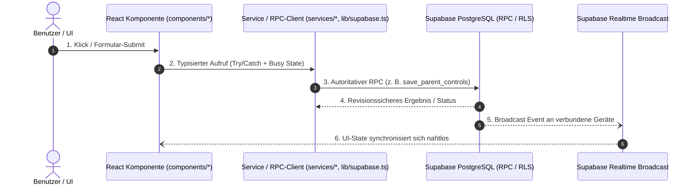

# 🗺️ Campus-Groovelab: Code-Topologie & Architektur-Landkarte

> **Zweck:** Schnelle semantische Navigation für Entwickler.  
> Zeigt auf einen Blick: *Wo liegt welcher Code? Welche Schichten interagieren? Wie verfolge ich einen Datenfluss von der UI bis zur Datenbank in 60 Sekunden?*

---

## 1. Top-Level Verzeichnis-Topologie

```
Groovelab app/
├── .agents/                    # Autoritatives Regelwerk, Invarianten & Master-Prompts
│   └── AGENTS.md               # Verfassungs-Dokument für Architektur, Security, BFSG 2025
├── apps/
│   └── groovelab/              # Haupt-Web- & PWA-Applikation (React 19 + TypeScript + Vite)
│       └── src/
│           ├── components/     # UI-Komponenten (geordnet nach Domänen)
│           │   ├── admin/      # Schulleitung & Verwaltung UI
│           │   ├── campus/     # Didaktik, Aufgaben, Messenger
│           │   ├── groovelab/  # Audio-Player, DAW, Synth
│           │   ├── secretary/  # Sekretariats-Dashboards & Raumplanung
│           │   ├── student/    # Schüler-Dashboard, Slots, Onboarding
│           │   ├── teacher/    # Lehrer-Studio & Klassenverwaltung
│           │   └── modals/     # Dialoge (AVV, PIN-Unlock, Rechnungen, AGBs)
│           ├── engine/         # WebAudio-Engine, Metronom, DSP
│           ├── services/       # Geschäftslogik & API-Services
│           ├── lib/
│           │   ├── supabase.ts # Supabase Client & RPC-Wrappers
│           │   └── security/   # Cryptographic & Auth Invariants
│           ├── types/          # Kanonische TypeScript Interfaces & Domain Models
│           └── App.tsx         # Globaler App-Container & Orchestrator
├── docs/                       # Living Registries, ADRs & Compliance Dossiers
│   ├── adr/                    # Architecture Decision Records
│   ├── SYSTEM_FEATURE_MATRIX.md# Lebender Fähigkeitskatalog
│   └── ARCHITECTURE_MAP.md     # Diese Datei
├── scripts/                    # Wartung, Seed-Daten & Security Scanner
└── supabase/                   # PostgreSQL Migrationen, RLS & RPC-Funktionen
    ├── migrations/             # Schema-Historie
    └── production_schema.sql   # DDL-Referenz aller Tabellen und Policies
```

---

## 2. End-to-End Datenfluss-Muster (The 60-Second Trace)

Jede Aktion in **Campus-Groovelab** folgt immer exakt demselben 4-stufigen Pfad. Du musst nie lange suchen:



---

## 3. Die 4 Bounded Contexts im Detail

### 🟢 1. Campus-Modul (Didaktik, Messenger, Termine)
- **Hauptkomponenten:**
  - `CampusSetupScreen.tsx`, `CampusDirectMessages.tsx`
  - `CampusEventsBoard.tsx`, `CampusTopicCard.tsx`
  - `ParentCampusActivationModal.tsx`, `ParentControlsModal.tsx`
  - `MeisterwerkDocumentationModal.tsx`
- **Verantwortliche Services:**
  - `services/notesService.ts`
  - `services/offlineSyncService.ts`
- **Datenbank & RPCs:**
  - Tabellen: `messages`, `channels`, `assignments`, `student_homework`
  - RPCs: `save_parent_controls`, `verify_parent_pin`
  - Realtime: `realtime:users:campus_ui_level`

### 🟡 2. GrooveLab-Modul (Audio, DAW, Kreativität)
- **Hauptkomponenten:**
  - `StudentAvatarDashboard.tsx`, `AudioTrackCarousel.tsx`
  - `LiveStageToolboxModal.tsx`, `BandProfileContent.tsx`
  - `EnsembleDashboard.tsx`, `GroupedSongCard.tsx`
- **Audio- & Synthesizer-Engine:**
  - `apps/groovelab/src/engine/` (WebAudio Context, MIDI, Metronom)
  - `services/audio/` & `services/neuralTtsService.ts`
- **Datenbank & Abrechnung:**
  - Tabellen: `bands`, `band_members`, `audio_assets`
  - Abrechnungsregel: Sammelzahler-Garantie (immer Schulträger, 0 € für Schüler)

### 🔴 3. Verwaltung, Admin, Sekretariat & Billing
- **Hauptkomponenten:**
  - `AdminDashboard.tsx`, `SecretaryDashboard.tsx`
  - `BillingDashboard.tsx`, `InvoicePreviewModal.tsx`
  - `ScheduleBoardDesktop.tsx`, `ScheduleCalendarView.tsx`
  - `AVVModal.tsx`, `DpoAuditPortal.tsx`
- **Kontext & Services:**
  - `context/MasterPricingContext.tsx`
  - `services/studentRosterService.ts`, `services/teacherStudioService.ts`
- **Datenbank & Abrechnung:**
  - Tabellen: `school_subscriptions`, `student_billing_plans`, `rooms`, `schedules`
  - DPO & Audit: `dpo_audit_logs`, `legal_consents`

### 🛡️ 4. Core Security, Multi-Tenancy & Auth
- **Hauptkomponenten:**
  - `LoginScreen.tsx`, `QRLandingPage.tsx`, `AdminSecuritySuiteModal.tsx`
  - `CampusPinUnlockModal.tsx`, `MaintenanceLockoutOverlay.tsx`
- **Sicherheits-Services:**
  - `lib/security/`
  - `services/auditLogService.ts`, `lib/errorTelemetry.ts`
- **Datenbank & RLS:**
  - RPCs: `authenticate_by_credential`, `authenticate_webauthn_credential`, `switch_user_active_role`
  - RLS-Doktrin: `school_id = get_current_user_school_id()`

---

## 4. Such- & Debugging-Cheat-Sheet für Entwickler

Wenn du ein Problem untersuchst, nutze diese gezielten Grep-Muster im Terminal:

| Was suchst du? | Schnell-Befehl (Grep / Ripgrep) |
|---|---|
| **Wo wird ein bestimmter RPC aufgerufen?** | `rg "rpc\('save_parent_controls'\)" apps/groovelab/src` |
| **Wo werden Schüler-Preise berechnet?** | `rg "0,49" apps/groovelab/src` |
| **Wo wird der UI-Level gewechselt?** | `rg "campus_ui_level" apps/groovelab/src` |
| **Welche Modals sind in App.tsx eingebunden?** | `rg "Modal" apps/groovelab/src/App.tsx` |
| **Gibt es unerlaubte direct-table auth queries?** | `npm run security:check` |
