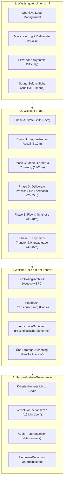

# 🎓 DeepMind 0,1% Goldstandard Analyse: Weltklasse-Musikpädagogik

> **Dokumenten-Status:** Kanonische Referenz-Architektur für modernen Instrumental- & Gesangsunterricht  
> **Kontext:** Campus & GrooveLab Didaktik-Ökosystem (Junior / Teen / Pro)  
> **Standard:** Kognitionspsychologisch fundiert, motorik-optimiert, unanfechtbar  

---

## 🏛️ Executive Summary & Ontologisches Fundament

Guter didaktischer Musikunterricht ist **keine Zufallsbegegnung zweier Personen am Instrument** und kein intuitives „Vor- und Nachspielen“. Auf dem **0,1% DeepMind Goldstandard-Niveau** ist moderner Musikunterricht ein **hochgradig kalibrierter kognitiver, sensomotorischer und psychologischer Transformationsprozess**. Er basiert auf den unumstößlichen Gesetzen der **Kognitionspsychologie (Sweller, Bandura)**, der **Neuroplastizität und Myelinisierung (Ericsson, Coyle)** sowie der **Motivationsforschung (Deci & Ryan, Csíkszentmihályi)**.

---

# TEIL I: Die 4 Säulen der Weltklasse-Didaktik



---

## 1. Was ist guter didaktischer Musikunterricht?

### A. Kognitives Lasten-Management (Cognitive Load Theory nach John Sweller)
Das menschliche Arbeitsgedächtnis kann maximal **$4 \pm 1$ Informations-Chunks** simultan verarbeiten. Im Musikunterricht kollidieren permanent:
- **Intrinsische Last:** Tonhöhe, Rhythmus, Fingerhaltung, Anschlagsdynamik, Tempo.
- **Extrinsische Last (zu eliminieren!):** Unübersichtliche Notenblätter, akustische Störgeräusche, unpräzise Lehrersprache, Ablenkungen.
- **Germane Last (zu maximieren!):** Das tatsächliche Konstruieren mentaler Schemata (z. B. das Verstehen eines synkopischen Grooves oder Lagenwechsels).

> **0,1% Axiom:** Ein Weltklasse-Pädagoge isoliert ausnahmslos Variablen. Niemals werden Tonhöhe, Rhythmus und Dynamik simultan neu eingeführt. Erst der Puls, dann der Rhythmus, dann die Töne, dann der musikalische Ausdruck.

### B. Neurobiologie & Myelinisierung (K. Anders Ericsson & Daniel Coyle)
- Muskelgedächtnis existiert neurologisch nicht. Was existiert, ist die **Myelinisierung**: Das Ummanteln von Nervenbahnen durch Myelinscheiden bei wiederholtem, hochfokussiertem Feuern.
- Je dicker die Myelinschicht, desto blitzschneller und widerstandsloser gleitet das Signal vom Gehirn in die Finger/Stimmbänder.
- **Die Gefahr:** Myelin ist blind. Wer Fehler wiederholt, myelinisiert Fehler.
- **Das Axiom:** *„Practice does not make perfect. Practice makes permanent. Only perfect practice makes perfect.“* Guter Unterricht verlangsamt das Tempo soweit („Sub-Tempo“), bis die Ausführung **100% fehlerfrei** gelingt.

### C. Der Flow-Kanal & Dynamic Difficulty Adjustment (Mihály Csíkszentmihályi)
- Zu hohe Anforderung $\rightarrow$ **Amygdala-Aktivierung, Angst, Frustration, motorisches Erstarren**.
- Zu niedrige Anforderung $\rightarrow$ **Unterstimulation, Langeweile, kognitives Abschalten**.
- Ein Spitzenpädagoge betreibt permanente **Mikro-Adaption** (Dynamic Difficulty Adjustment): Verfehlt der Schüler die Übung 2 Mal hintereinander, wird der Chunk halbiert oder das Tempo um 20 % gedrosselt. Schafft er es mühelos, wird ein dynamischer oder artikulatorischer Parameter hinzugefügt.

### D. Sound Before Sight (Auditives Primat nach Gordon & Kodály)
- Musik ist eine auditive Kunst, keine visuelle Noten-Entschlüsselungsübung.
- Wer Noten spielt, ohne die klingende Zielvorstellung im Innenohr zu haben, betreibt „Tippen nach Zahlen“.
- **Goldstandard:** Zuerst Hören $\rightarrow$ dann Singen / Vokalisieren / Klatschen $\rightarrow$ dann Greifen am Instrument $\rightarrow$ zuletzt Notations-Symbolik.

---

## 2. Wie läuft weltklasse didaktischer Unterricht ab? (Die deterministische Phasen-Architektur)

Eine standardisierte 45-Minuten-Lerneinheit folgt einem choreographierten Spannungsbogen:

```
[00:00 - 05:00]  PHASE A: State-Shift & Grounding (Mentale Nullung)
[05:00 - 12:00]  PHASE B: Diagnostischer Recall & Retro-Audit (Zero-Blame)
[12:00 - 20:00]  PHASE C: Kognitiver Impuls & Meister-Modellierung
[20:00 - 35:00]  PHASE D: Deliberate Practice & Guided Scaffolding (<3s Feedback)
[35:00 - 40:00]  PHASE E: Flow-Synthese & Musikalische Performance
[40:00 - 45:00]  PHASE F: Feynman-Recall & Hausaufgaben-Verankerung
```

### Phase A: State-Shift & Grounding (00:00 – 05:00)
- **Ziel:** Transformation des Schülers vom Hektik-Modus des Alltags (Schule, Arbeit, Verkehr) in den parasympathischen Fokus-Zustand.
- **Aktion:** Ergonomie-Check (Sitzhöhe, Handgelenkwinkel), 3 tiefe Atemzüge, kurzes motorisches Kalibrieren (Puls spüren, lockeres Ausstreichen, rudimentärer Warm-up-Beat ohne Leistungsdruck).
- **Verbot:** Sofortiges Aufschlagen des Notenhefts mit den Worten „Wo waren wir stehen geblieben?“.

### Phase B: Diagnostischer Recall & Retro-Audit (05:00 – 12:00)
- **Ziel:** Erhebung des Ist-Zustands der Hausaufgabe – **ohne Prüfungsangst**.
- **Aktion:** Der Schüler spielt die vereinbarte Passage ohne Lehrerunterbrechung durch. Die Lehrkraft beobachtet mit „Adleraugen“: Wo stockt der Atem? Welche Finger kompensieren? Wo bricht der Puls ein?
- **Didaktische Regel:** Die Lehrkraft unterbricht **nicht** beim ersten Fehler. Erst den Gesamtdurchlauf spüren lassen, um Frustrationstoleranz zu stärken.

### Phase C: Kognitiver Impuls & Meister-Modellierung (12:00 – 20:00)
- **Ziel:** Schaffen einer glasklaren auditiven und visuellen Zielvorstellung (Albert Bandura: Modell-Lernen).
- **Aktion:** Die Lehrkraft spielt die Ziel-Passage auf Konzert-Niveau vor (inklusive Körpersprache, Gestus und Tonqualität).
- **Atomisierung (Chunking):** Das neue Material wird in die kleinste sinnvolle Einheit zerlegt: Ein Takt, ein Lagenwechsel, ein einzelnes Rudiment.

### Phase D: Deliberate Practice & Guided Scaffolding (20:00 – 35:00)
- **Ziel:** Hochfrequente, myelineffiziente Repetition in der Zone der nächsten Entwicklung.
- **Micro-Feedback-Loops:** Die Rückmelde-Latenz beträgt **unter 3 Sekunden**. Nicht 5 Minuten spielen lassen und dann monologisieren, sondern nach 2 Takten anhalten: *„Stop. Achte auf den Druck im Ringfinger. Noch einmal.“*
- **Metakognitives Fragespiel:** Statt *„Dein Daumen war krumm!“* fragt der Pädagoge: *„Wo im Unterarm hast du gerade Spannung gefühlt?“* Der Schüler lernt, seinen eigenen Körper sensorisch zu scannen.

### Phase E: Flow-Synthese & Musikalische Performance (35:00 – 40:00)
- **Ziel:** Entlassung aus dem Sezier-Modus in die musikalische Freiheit.
- **Aktion:** Das isolierte Element wird in den Gesamtsong re-integriert. Mit Playalong, Lehrerbegleitung am Klavier/Bass oder als Duett.
- **Regel:** Hier wird **nicht mehr korrigiert**. Wenn ein Fehler passiert: Durchspielen! Timing und Kontinuität stehen über lokaler Perfektion.

### Phase F: Feynman-Recall & Hausaufgaben-Verankerung (40:00 – 45:00)
- **Ziel:** Garantieren, dass zu Hause kein „Fehler-Einschleifen“ stattfindet.
- **Aktion:** Der Schüler demonstriert die Übungsmethode selbst und formuliert den Auftrag mit eigenen Worten (**Feynman-Prinzip**). Aufnahme eines 15-Sekunden-Audio-Memos im Campus/GrooveLab Cockpit.

---

## 3. Welche Rolle hat die Lehrkraft?

Der traditionelle Typus des „allwissenden Zuchtmeisters“ oder des „passiven Zuhörers, der Fehler mit Rotstift anstreicht“, ist didaktischer Bankrott. Der Weltklasse-Pädagoge vereint vier hochspezialisierte Rollen:

1. **Der Scaffolding-Architekt (nach Lew Wygotski):**
   - Er baut ein kognitives und motorisches Baugerüst um die Aufgabe.
   - Sobald der Schüler Stabilität gewinnt, zieht der Lehrer das Gerüst schrittweise zurück (*Fading*).
2. **Der Präzisions-Chirurg des Feedbacks (nach John Hattie):**
   - **Toxisch:** Vages Lob (*„Super gemacht!“*, *„Sehr schön!“*) oder destruktive Kritik (*„Das war falsch!“*).
   - **Goldstandard:** Deskriptives, handlungsorientiertes Prozessfeedback: *„Der Rhythmus in Takt 3 war auf die Millisekunde präzise. In Takt 4 hast du die Sechzehntel verkürzt – spiele Takt 4 jetzt isoliert mit Akzent auf der 1.“*
3. **Der Wächter der psychologischen Sicherheit (Amygdala-Schutz):**
   - Angst schüttet Cortisol und Noradrenalin aus; der präfrontale Kortex und die Feinmotorik werden biochemisch blockiert.
   - Der Lehrer etabliert Fehler als **„wertvolle Datenpunkte zur Kalibrierung“**, niemals als persönliches Versagen.
4. **Der Übe-Stratege („Teaching How To Practice“):**
   - Die Lehrkraft unterrichtet primär nicht das Instrument, sondern bringt dem Schüler bei, **wie man zu Hause übt**. 95 % des Lernfortschritts geschehen zwischen den Unterrichtsstunden. Wenn der Schüler nicht weiß, wie er üben soll, ist der Unterricht wertlos.

---

## 4. Wie muss die Arbeitsanweisung (Hausaufgabe) didaktisch korrekt mitgeteilt werden?

### A. Die Toxizität des Zeit-Axioms
> ❌ **Didaktisches Versagen:** *„Übe jeden Tag 20 Minuten bis nächste Woche.“*  
> **Folge:** Der Schüler setzt sich hin, spielt das Stück von vorne bis hinten durch, stolpert jedes Mal an Takt 12, ignoriert es, spielt weiter und schaut alle 3 Minuten auf die Uhr. Nach 20 Minuten hat er den Fehler in Takt 12 zwanzigmal tief ins Myelin eingebrannt.

### B. Das 0,1% Kriterien-Axiom
> ✅ **Goldstandard-Aufgabe:**  
> *„Takt 12 bis 14: Spiele diesen Übergang mit Metronom bei 60 BPM. Ziel: 3 Durchläufe hintereinander ohne Verspieler und mit lockerem Nacken. Wenn das klappt, erhöhe auf 72 BPM.“*

### C. Das dreiteilige Standard-Hausaufgaben-Protokoll

| Parameter | Inhalt | Didaktische Begründung |
| :--- | :--- | :--- |
| **1. Target (Was & Wo)** | Exakter Formteil / Taktbereich (z. B. *„Refrain Takt 17–20“*) | Verhindert sinnloses „Durchdudeln“ des gesamten Stücks. |
| **2. Method (Wie)** | Spezifische Übestrategie (z. B. *„Sub-Tempo 50%“*, *„Staccato-Übung“*, *„Looping“*) | Gibt dem Gehirn das exakte Werkzeug zur Problembehebung. |
| **3. Metric (Wann fertig)** | Messbares Erfolgskriterium (z. B. *„3x fehlerfrei hintereinander“*) | Gibt dem Schüler Dopamin-Ausschüttung bei Erreichen des Ziels. |

### D. Die 4 Säulen des Transfers
1. **Der Audio-Anker:** Vor Verlassen des Raums nimmt die Lehrkraft die Passage in Reinform auf (Audio-Memo im GrooveLab/Campus Meisterwerk). Der Schüler hat zu Hause eine unbestechliche Referenz.
2. **Der Feynman-Check:** Der Schüler liest den Eintrag nicht nur, sondern erklärt der Lehrkraft: *„Erklär mir kurz: Was genau machst du zu Hause, wenn du an Takt 12 kommst?“*
3. **Pacing:** Maximal **1 bis 3 konkrete Micro-Aufgaben**. Niemals 5 verschiedene Baustellen gleichzeitig aufreißen.
4. **Eltern-Brücke (bei Kids/Teens):** Die Aufgabe wird im Campus Eltern-Bereich visualisiert. Eltern müssen keine Musiker sein; sie sehen: *„Ziel: Takt 12 dreimal sauber. Status: 1/3 gemeistert.“*

---

# TEIL II: Die erschöpfende 0,1% Goldstandard-Liste (40 Kern-Axiome)

Hier ist die detaillierte, unbestechliche Liste aller kritischen didaktischen Punkte für weltklasse Musikunterricht:

---

### A. Kognition, Neurobiologie & Lernpsychologie (Punkte 1–8)

1. **Axiom der minimalen kognitiven Belastung (Sweller-Filter):**  
   Überlaste niemals das Arbeitsgedächtnis. Trenne motorische Koordination, rhythmische Dekodierung und tonale Differenzierung in separate Lernschritte.
2. **Das Gesetz der fehlerfreien Myelinisierung:**  
   Jeder fehlerhafte Durchlauf brennt die falsche Synapsen-Verschaltung ein. Reduziere das Tempo drastisch, bis der Schüler die Passage absolut fehlerfrei ausführen kann. Geschwindigkeit ist ein Nebenprodukt von Präzision.
3. **Auditory Pre-Imaging (Das innere Hörbild):**  
   Wer keinen Ton innerlich hört, bevor die Hand ihn spielt, tippt blind Tasten. Fordere den Schüler auf, Passagen vor dem Spielen innerlich oder leise summend vorzuhören.
4. **Dynamic Difficulty Adjustment (DDA):**  
   Halte den Schüler zu 100 % im Flow-Kanal. Scheitert eine Übung 2 Mal: Zerlege sie sofort. Gelingt sie 3 Mal mühelos: Erhöhe die Komplexität um genau eine Nuance.
5. **Dopaminerge Zielmarken (Micro-Wins):**  
   Teile 45 Minuten in 3–5 kleine, erreichbare Etappenziele auf. Jeder spürbare Fortschritt löst Dopamin aus, festigt die synaptische Plastizität und eliminiert Frustration.
6. **Schlaf-abhängige Gedächtniskonsolidierung:**  
   Erkläre dem Schüler, dass das eigentliche motorische Können nicht während der Übung, sondern in der folgenden REM-Schlafphase im Gehirn verdrahtet wird. Regelmäßiges, kurzes Üben schlägt stundenlanges Wochenend-Blocküben um ein Vielfaches.
7. **Motor-Inhibition (Abschalten unbeteiligter Muskeln):**  
   Feinmotorik erfordert selektive Muskelanspannung. Beobachte kontinuierlich Kiefer, Zunge, Schultern und Nacken. Unnötige Co-Kontraktionen rauben Kraft und Präzision.
8. **Interleaving vs. Blocked Practice (Variables Lernen):**  
   Sobald ein Motiv sitzt, übe es nicht 50 Mal isoliert, sondern wechsle zwischen Motiv A, Motiv B und Motiv C hin und her. Interleaving zwingt das Gehirn zu wiederholtem Retrieval und verankert Inhalte dauerhaft.

---

### B. Die Stundenchoreographie & Phasen-Architektur (Punkte 9–16)

9. **Der 5-Minuten-State-Shift:**  
   Beginne niemals ohne mentale Nullung. Der Schüler kommt oft gestresst aus der Schule oder dem Beruf. 2–3 Minuten Pulsieren, Atemarbeit und Ergonomie-Justierung sind Pflicht.
10. **Zero-Blame Retro-Audit:**  
    Beginne die Überprüfung der Hausaufgabe niemals mit Anschuldigungen (*„Hast du geübt?“*). Lass den Schüler spielen, höre wertfrei zu und nutze die Performance als diagnostische Datengrundlage.
11. **Das Gesetz des ununterbrochenen ersten Durchlaufs:**  
    Unterbrich den Schüler nicht bei der ersten falschen Note. Gib ihm die Chance, sich selbst zu regulieren und den musikalischen Gesamtzusammenhang nicht zu verlieren.
12. **Modell-Präsentation auf Konzert-Niveau:**  
    Demonstriere neue Stücke oder Phrasen mit maximaler musikalischer Leidenschaft und klanglicher Exzellenz. Begeisterung überträgt sich über Spiegelneuronen.
13. **Chirurgisches Chunking (Die 2-Takt-Regel):**  
    Beginne bei Problemen niemals am Anfang des Stücks. Isoliere die exakte Problemstelle (oft nur 2 Noten oder 1 Taktübergang) und bearbeite ausschließlich diese.
14. **Die 3-Sekunden-Feedback-Regel:**  
    Während der Deliberate-Practice-Phase muss Feedback binnen 3 Sekunden nach dem Spiel erfolgen. Lange Erklärungsmonologe der Lehrkraft töten den motorischen Lerneffekt.
15. **Performance-Synthese vor Stundenabschluss:**  
    Mindestens 5 Minuten vor dem Ende der Stunde muss der Sezier-Modus verlassen werden. Spiele gemeinsam mit dem Schüler das Stück durch – für den reinen musikalischen Genuss und das Flow-Erlebnis.
16. **Die unantastbaren letzten 5 Minuten:**  
    Packe die Instrumententasche nicht hektisch im Gehen. Die letzten 5 Minuten sind das heiligste didaktische Fenster zur Festigung der Hausaufgabe und zur metakognitiven Reflexion.

---

### C. Haltung, Sprache & Interaktion der Lehrkraft (Punkte 17–24)

17. **Transformation zum Scaffolder:**  
    Sieh dich nicht als „Lehrender“, sondern als „Baugerüst“. Hilf so viel wie nötig, ziehe dich so schnell wie möglich zurück, damit der Schüler Selbstwirksamkeit erfährt.
18. **Eliminierung von Null-Feedback („Super/Toll“):**  
    Ersetze generisches Lob durch prozessorientiertes Präzisions-Feedback: *„Deine Handgelenksführung in Takt 6 war absolut ruhig – dadurch klang der Ton voll und zentriert.“*
19. **Die Sokratische Fragemethode:**  
    Sage dem Schüler nicht, was falsch war. Frage ihn: *„Wie hat sich der Übergang von Takt 4 auf 5 für dich angefühlt?“* oder *„War die Bassdrum vor oder hinter dem Klick?“*
20. **Schutz der psychologischen Amygdala-Sicherheit:**  
    Schaffe einen Raum, in dem Fehler zelebriert werden als Entdeckungsreisen. Ein ängstlicher Schüler hat steife Muskeln und lernt motorisch nichts.
21. **Augenhöhe statt Podest-Pädagogik:**  
    Passe deine Körpersprache an. Sitze auf gleicher Augenhöhe, wende dich dem Schüler frontal/halb-offen zu und halte eine offene, ermutigende Gestik.
22. **Ökonomie der Lehrersprache (Keep it short):**  
    Verringere deine Redezeit drastisch. Im 0,1% Unterricht musiziert und reflektiert der Schüler zu mindestens 70 % der Zeit. Der Lehrer spricht in prägnanten, präzisen Impulsen.
23. **Didaktische Validierung vor Korrektur (3:1 Regel):**  
    Benenne mindestens zwei Dinge, die bereits hervorragend funktionieren, bevor du den nächsten Korrekturpunkt ansteuerst.
24. **Vorbildfunktion in Ergonomie und Haltung:**  
    Demonstriere am Instrument jederzeit eine vorbildliche, gelöste und natürliche Körperstatik. Der Schüler imitiert unbewusst deine Muskeltonus-Spiegelungen.

---

### D. Übemethodik & Instrumentale Werkzeuge (Punkte 25–32)

25. **Sub-Tempo & Puls-Skelettierung:**  
    Halbiere das Tempo bei komplexen rhythmischen Mustern. Spiele zuerst nur das harmonische Skelett (Grundtöne auf Zählzeit 1) vor den Verzierungen.
26. **Loop-Training & Rhythmisches Permutieren:**  
    Lasse den Schüler schwierige Läufe punktiert (lang-kurz und kurz-lang) oder in Mini-Schleifen von 3 Noten üben, um motorische Blockaden im Gehirn aufzulösen.
27. **Blind-Playing (Propriozeptions-Training):**  
    Lasse den Schüler Passagen mit geschlossenen Augen spielen. Das schaltet den visuellen Kortex ab und zwingt das Gehirn, sich auf Haptik, Gehör und Muskelfeedback zu verlassen.
28. **Rhythmische Vokalisation (Ta-Ki-Te / Konnakol / Beatboxing):**  
    Was du nicht sprechen oder klatschen kannst, kannst du auf keinem Instrument spielen. Vokalisiere Rhythmen vor dem ersten Anschlag.
29. **Chaining (Vorwärts- und Rückwärtsverkettung):**  
    Übe schwierige Phrasen von hinten nach vorne (*Backward Chaining*). Der Schüler bewegt sich dadurch von der unbekannten Problemstelle immer hinein in bekanntes, sicheres Terrain.
30. **Isolierung der „Kollisionstakte“:**  
    Fehler entstehen selten in der Mitte eines Taktes, sondern an den Nahtstellen (Taktwechsel, Lagenwechsel, Registerübergang). Übe gezielt die Nahtstelle (z. B. letzte Zählzeit Takt 4 auf erste Zählzeit Takt 5).
31. **Mental-Training ohne Instrument:**  
    Lasse den Schüler die Noten oder Tasten im Kopf vor seinem geistigen Auge visualisieren, während er den Rhythmus auf den Oberschenkeln klopft.
32. **Verbindlicher Einsatz des Klicks / Metronoms:**  
    Das Metronom ist kein Folterinstrument, sondern der unparteiische Spiegel. Setze es auf halbe Zählzeiten (Backbeat auf 2 und 4) für organisches Timing-Gefühl.

---

### E. Hausaufgaben-Governance & Systemische Verankerung (Punkte 33–40)

33. **Absolutes Verbot von Zeit-Hausaufgaben:**  
    Schreibe niemals *„Übe 15 Minuten am Tag“* ins Aufgabenheft. Zeit ist kein Qualitätsmaßstab für neuronales Lernen.
34. **Das Gesetz der 3 fehlerfreien Durchläufe:**  
    Formuliere Hausaufgaben als Qualitäts-Challenge: *„Spiele Formteil A dreimal hintereinander ohne Unterbrechung fehlerfrei bei Tempo 65 BPM.“*
35. **Maximal 3 Micro-Goals pro Woche:**  
    Beschränke die Hausaufgabe auf 1 bis maximal 3 glasklar umrissene Aufgaben. Mehrere Baustellen verwässern den Fokus und erzeugen Frustration.
36. **Der Feynman-Transfer-Test:**  
    Lasse den Schüler vor dem Verlassen des Raums die Hausaufgabe erklären und die Übemethode kurz vorspielen. Versteht er es im Raum nicht, wird er zu Hause scheitern.
37. **Der Audio-/Video-Referenzanker:**  
    Nimm eine 15- bis 30-sekündige Audio- oder Video-Notiz direkt in das Schüler-Cockpit (GrooveLab / Meisterwerk) auf. So hat der Schüler das ideale Klangbild im Ohr.
38. **Eltern-Transparenz ohne Kontrollzwang:**  
    Informiere Eltern (insbesondere im *Junior*-Level) digital über das Campus-Dashboard über das konkrete Wochenziel, damit sie das Kind positiv bestärken können, statt belehrend zu kontrollieren.
39. **Die Dual-Voting Selbsteinschätzung:**  
    Lasse den Schüler vor der Stunde seine eigene Leistung digital bewerten (Selbsteinschätzung). Vergleicht in der Stunde Schülereinschätzung und Lehrerfeedback zur Schärfung der metakognitiven Selbstwahrnehmung.
40. **Die Kultur des kontinuierlichen Stolzes:**  
    Beende jede Einheit und jede Hausaufgaben-Übergabe mit einer Würdigung der geleisteten mentalen Arbeit. Der Schüler muss den Raum mit Vorfreude auf das heimische Üben und das nächste Treffen verlassen.

---

## 🎯 Fazit & Didaktische Matrix

| Dimension | Traditioneller Musikunterricht (Fehlgeleitet) | 0,1% DeepMind Goldstandard (Campus/GrooveLab) |
| :--- | :--- | :--- |
| **Philosophie** | Stoff abarbeiten, Noten ablesen | Neurodidaktische Potenzialentfaltung & Flow |
| **Fokus** | Stück von vorne bis hinten durchspielen | Chirurgisches Chunking & Deliberate Practice |
| **Feedback** | Spät, vage (*„Ja, ganz gut!“*) | Binnen 3 Sekunden, handlungsorientiert, metakognitiv |
| **Hausaufgabe** | *„Übe 20 Minuten am Tag“* | *„Takt 5–8, Tempo 60 BPM, 3x hintereinander fehlerfrei“* |
| **Lehrerrolle** | Kontrolleur & Notenverteiler | Kognitiver Scaffolding-Architekt & Ermöglicher |
| **Technologie** | Zettelwirtschaft & Vergessen | Integriertes Campus/GrooveLab Cockpit mit Audio-Anker |

*Dieses Dokument definiert das unverrückbare pädagogische Fundament für jede Unterrichtsstunde im gesamten Campus- und GrooveLab-Netzwerk.*
