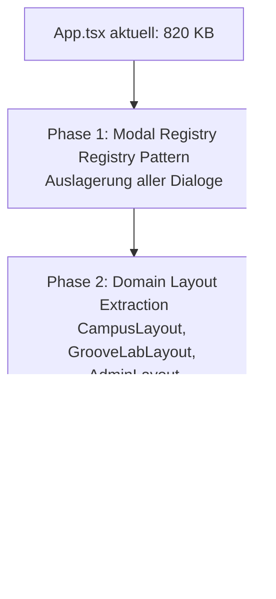

# 🏛️ Campus-Groovelab: Entlastungs-Roadmap für App.tsx
> **Ziel:** Schrittweise, risikofreie Entlastung der zentralen Orchestrator-Datei (`App.tsx`, 820 KB)  
> **Axiom:** Keine Breaking Changes, kein Big-Bang-Rewrite. Schrittweise Extraktion in Bounded Contexts.

---

## 1. Das Kernproblem: Warum App.tsx überlastet ist

Mit über 820 KB Größe vereint `App.tsx` derzeit vier unterschiedliche Aufgaben:
1. **Globaler Provider-Baum** (Auth, Theme, Pricing, Audio, Realtime).
2. **Modul-Routing & Navigation** (Campus vs. GrooveLab vs. Admin/Sekretariat).
3. **Modal-Orchestrierung** (> 30 Dialoge und Overlays mit jeweils eigenen Props und Triggern).
4. **Globale Event-Listener & Telemetrie** (Window-Resize, Offline-Events, Realtime-Sockets).

Dies führt zu:
- Langsamem Feedback im Editor / IDE (hohe Latenz bei Autocomplete und Linting).
- Erhöhtem Risiko von unbeabsichtigten Re-Renders.
- Mentalem Ballast beim Entwickeln („Ich scrolle durch 5.000 Zeilen, um eine Routing-Bedingung zu finden“).

---

## 2. Die 3-Phasen-Entlastungsstrategie (Zero-Downtime)



---

### Phase 1: Die „Modal Hub“-Auslagerung (ca. 40% Entlastung)
- **Status Quo:** `App.tsx` importiert und rendert dutzende Modals (`AVVModal`, `LegalTextModal`, `ParentControlsModal`, `InvoicePreviewModal`, etc.) direkt im Haupt-JSX.
- **Lösung:** Einführung eines `GlobalModalHub.tsx` (oder modularer Dialog-Registries):
  ```tsx
  // Vorher in App.tsx:
  {isAVVOpen && <AVVModal ... />}
  {isLegalOpen && <LegalTextModal ... />}
  {isParentControlsOpen && <ParentControlsModal ... />}
  
  // Nachher in App.tsx:
  <GlobalModalHub />
  ```
- **Vorteil:** `App.tsx` verliert sofort tausende Zeilen Render-Logik. Alle Modal-Zustände werden über einen schlanken Context gesteuert.

---

### Phase 2: Domain-Layout-Container (ca. 40% Entlastung)
- **Status Quo:** Das Rendern der Hauptbereiche (Campus, GrooveLab, Schulleitung, Sekretariat) mit ihren jeweiligen Toolbars, Seitenleisten und Breadcrumbs ist in langen conditional blocks in `App.tsx` verschachtelt.
- **Lösung:** Reine Domain-Container:
  - `modules/campus/CampusModuleContainer.tsx`
  - `modules/groovelab/GrooveLabModuleContainer.tsx`
  - `modules/verwaltung/VerwaltungModuleContainer.tsx`
- **Vorteil:** Jeder Bounded Context hat seinen eigenen Verantwortlichen. Wenn du am GrooveLab-Metronom arbeitest, öffnest du nur das GrooveLab-Modul.

---

### Phase 3: Der schlanke App-Orchestrator (< 250 Zeilen)
Am Ende des Prozesses besteht `App.tsx` nur noch aus dem sauberen Provider-Baum und dem Root-Router:

```tsx
export function App() {
  return (
    <ErrorBoundary>
      <ThemeProvider>
        <AuthProvider>
          <TenancyProvider>
            <MasterPricingProvider>
              <RootLayout>
                <ModuleRouter />
                <GlobalModalHub />
                <GlobalBroadcastBanner />
              </RootLayout>
            </MasterPricingProvider>
          </TenancyProvider>
        </AuthProvider>
      </ThemeProvider>
    </ErrorBoundary>
  );
}
```

---

## 3. Goldene Refactoring-Regeln für Entwickler

1. **Niemals mehr als ein Modal pro PR / Commit auslagern.**  
   So bleibt jede Änderung auditierbar und rückrollbar.
2. **Keine Verhaltensänderung während der Auslagerung.**  
   Erst reine 1:1 Verschiebung (Refactoring), Verifikation per `npm run gate`, dann erst neue Features implementieren.
3. **Tests als Schutznetz:** Vor der Extraktion sicherstellen, dass die Invarianten-Prüfung grün ist.
