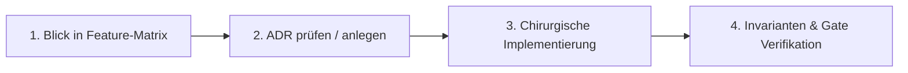

# 🛡️ Campus-Groovelab: Das 1% Betreiber- & Entwickler-Playbook
> **Leitfaden für den Alltag:** Wie du täglich mit maximaler Ruhe, messerscharfem Fokus und ohne kognitiven Ballast an **Campus-Groovelab** arbeitest.

---

## 1. Das 3-Minuten Morgen-Ritual (Morning Health & Clarity)

Bevor du die erste Zeile Code schreibst oder ein Ticket bearbeitest:

1. **System-Check über die KI starten:**  
   Schreibe kurz `Guten Morgen` an deinen KI-Agenten.  
   *(Der automatisierte Morning Check führt automatisch `npm run security:check`, `npm run security:secrets` und `npx tsc --noEmit` aus).*
2. **Ergebnisbericht prüfen:**  
   - 0 Drift-Verstöße?
   - 0 Secret-Leaks?
   - TypeScript 100% sauber?
3. **Ergebnis:** Du startest den Tag mit dem beruhigenden Wissen: **Die Plattform steht stabil wie eine Festung.** Kein unsichtbarer Bug lauert im Verborgenen.

---

## 2. Der 4-Phasen-Feature-Workflow (Verhindert jeglichen Wissensverlust)

Wenn du ein neues Feature planst oder ein bestehendes anpassen willst:

### Phase 1: 30-Sekunden-Blick in die Feature-Matrix (`docs/SYSTEM_FEATURE_MATRIX.md`)
- Zu welchem der 4 Bounded Contexts gehört die Änderung? (*Campus*, *GrooveLab*, *Verwaltung*, *Platform*)
- Welcher autoritative RPC / welche Tabelle ist die Single Source of Truth?
- Welche goldenen Invarianten gelten?

### Phase 2: ADR-Check (Warum ist es so?)
- Berührt deine Änderung eine grundlegende Logik (z. B. Abrechnung, PIN, Barrierefreiheit)?
- Lies kurz die betreffende ADR in `docs/adr/`. Du vermeidest in 10 Sekunden den Rückfall in alte Fehlannahmen.

### Phase 3: Chirurgisches Coden (Bounded Context Respektieren)
- Codiere ausschließlich innerhalb des Modul-Kontexts.
- Keine Querverflechtungen (z. B. keine GrooveLab-Audio-Logik in ein Campus-Didaktik-Formular importieren).

### Phase 4: Nachbereitung & Dokumentation
- Ergänze eine Zeile in `docs/SYSTEM_FEATURE_MATRIX.md`, falls ein neuer RPC oder ein neues Feature entstanden ist.
- Verifiziere beim Commit mit dem Codewort `commit` (führt `npm run gate` aus).

---

## 3. Die KI als Exocortex (Richtig delegieren statt im Kopf behalten)

Verwende deinen KI-Agenten nicht nur als Schreibkraft, sondern als dein **lebendes Systemarchiv**.

### Drei mächtige Prompts, die dir sofort Stunden an Recherche sparen:

1. **Topologie-Check vor großen Umbauten:**
   > *„Agent, ich plane Feature X im Campus-Modul. Zeige mir alle Komponenten, RPCs und Tabellen, die davon berührt werden, und prüfe gegen unsere ADRs.“*

2. **Compliance & Barrierefreiheits-Review:**
   > *„Agent, prüfe diese UI-Komponente auf BFSG 2025 / WCAG 2.2 AA Konformität: Sind 44px Touch-Targets, Keyboard-Handling und Slate-900 auf Gelb gewahrt?“*

3. **Integritäts-Vergleich mit der Feature-Matrix:**
   > *„Agent, aktualisiere die SYSTEM_FEATURE_MATRIX.md um unser neues Feature und liste auf, welche Invarianten einzutragen sind.“*

---

## 4. Das 15-Minuten Freitags-Ritual (Architektur-Hygiene)

Freitags vor dem Feierabend:
- 10 Minuten: Blick in `docs/SYSTEM_FEATURE_MATRIX.md` – stimmt alles mit dem aktuellen Produktstand überein?
- 5 Minuten: Gab es diese Woche eine wichtige Grundsatzentscheidung? Wenn ja, erstelle kurz `ADR-006`.
- **Wochenend-Effekt:** Du verlässt den Schreibtisch mit vollkommen freiem Kopf, weil das gesamte Wissen im System gesichert ist.
