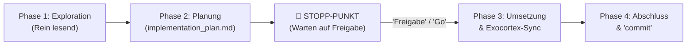

# 🛡️ Campus-Groovelab: Das 1% Betreiber- & Operator-Playbook
> **Klassifizierung:** TIER-1 MULTI-TENANT SAAS OPERATING SYSTEM (OWASP ASVS LEVEL 3 | BFSG 2025 | CLEAN ARCHITECTURE)  
> **Ziel:** Wie du als Betreiber (Patrick) täglich mit maximaler Ruhe, messerscharfem Fokus, 0 kognitivem Ballast und 100% juristischer & technischer Sicherheit Campus-Groovelab führst.

---

## 🧭 Das 1% Betreiber-Betriebssystem im Überblick

```
┌──────────────────────────────────────────────────────────────────────────────────┐
│                             CHIEF OPERATOR & ARCHITECT                           │
│                       (Patrick: Absicht, Scope & Freigaben)                      │
└────────────────────────────────────────┬─────────────────────────────────────────┘
                                         │
               ┌─────────────────────────┼─────────────────────────┐
               ▼                         ▼                         ▼
     ┌──────────────────┐      ┌──────────────────┐      ┌──────────────────┐
     │ 1. MORNING CHECK │      │ 2. FEATURE RYTHM │      │ 3. WEEKLY AUDIT  │
     │  'Guten Morgen'  │      │  4-Phasen-Flow   │      │ 'Freitags-Check' │
     │  (10s / 4 Gates) │      │  (Zero-Auto-Exec)│      │ (20s / 24 Suites)│
     └─────────┬────────┘      └─────────┬────────┘      └─────────┬────────┘
               │                         │                         │
               └─────────────────────────┼─────────────────────────┘
                                         ▼
┌──────────────────────────────────────────────────────────────────────────────────┐
│                   4. MUSIKSCHUL-SUPPORT & INCIDENT PIPELINE                      │
│      Stufe 1: Simulation ──> Stufe 2: Ghost-Mode ──> Stufe 3: Forensik-Dossier   │
└────────────────────────────────────────┬─────────────────────────────────────────┘
                                         ▼
┌──────────────────────────────────────────────────────────────────────────────────┐
│                          5. LIVING EXOCORTEX (SSOT)                              │
│       docs/SYSTEM_FEATURE_MATRIX.md & docs/BILLING_CANONICAL_LOGIC.md            │
└──────────────────────────────────────────────────────────────────────────────────┘
```

---

## 1. Das 10-Sekunden Morgen-Ritual (Morning Clarity & Health)

Bevor du die erste Zeile Code schreibst, ein Ticket öffnest oder E-Mails liest:

### Ablauf im Chat
1. **Trigger senden:**  
   Schreibe kurz **`Guten Morgen`** (oder **`Morning Check`**) an Antigravity.
2. **Automatisierte Ausführung:**  
   Der Agent führt vollautomatisch den 5-fachen Sicherheits- & Compliance-Check aus:
   ```bash
   npm run operator:morning   # identisch zu: npm run gate
   ```
   - **Gate 1:** `security:check` (Security Drift Guard & Architektur-Invarianten, DIN EN ISO/IEC 27001)
   - **Gate 2:** `security:secrets` (Entropie- & Secret-Leak-Scanner)
   - **Gate 3:** `legal:check` (12-Säulen / 18 unbestechliche Checks Legal Guard)
   - **Gate 4:** `verify:headers:static` (Offline Static Security Headers Guard nach BSI TR-02102-2 & Mozilla A+)
   - **Gate 5:** `typecheck` (Strikte TypeScript Typprüfung über 4 Workspaces)
3. **Ergebnisbericht im Chat:**  
   Du erhältst das strukturierte **Morning Health Briefing**:
   - 0 Drift-Verstöße, 0 Secret-Leaks
   - 18/18 Checks in allen 12 Rechts-Säulen bestanden (BFSG 2025, DSGVO Art. 8/9/17, BGB, UrhG, KUG § 22, Clean Dashboard Wording)
   - Static Headers 100% konform
   - TypeScript 100% sauber über Monorepo
4. **Ergebnis:** Du weißt mit mathematischer Gewissheit: **Die Plattform steht absolut stabil.**

---

## 2. Der hermetische 4-Phasen-Feature-Workflow

Jede Weiterentwicklung, Modulerweiterung oder jedes Refactoring folgt dem strikten Standard:



### Phase 1: Exploration (Rein lesend)
- Bounded Context isolieren (*Campus* grün, *GrooveLab* gelb, *Verwaltung* rot).
- Invarianten und bestehende RPCs prüfen. Keine Code-Änderungen in dieser Phase.

### Phase 2: Planung & Zwingender Stopp-Punkt (Zero Auto-Execute)
- Antigravity erstellt die `implementation_plan.md` mit konkreten Dateipfaden, RPCs und Tests.
- **🛑 ZWINGENDER STOPP-PUNKT:** Die KI stoppt ausnahmslos. Selbst IDE-System-Hooks können diesen Stopp nicht umgehen. Du prüfst den Plan und antwortest mit `Freigabe` oder Anpassungswünschen.

### Phase 3: Chirurgische Implementierung & Exocortex-Sync
- Nach deiner expliziten Freigabe wird der Code umgesetzt (Typen ➔ Hooks ➔ UI).
- **🧠 Pflichtschritt Exocortex-Synchronisation:** Die zentrale Product Bible [`docs/SYSTEM_FEATURE_MATRIX.md`](file:///Users/patrickhuber/Documents/Antigravity%20Projects/Groovelab%20app/docs/SYSTEM_FEATURE_MATRIX.md) wird im selben Zug mit der neuen Feature-ID und den Invarianten aktualisiert.

### Phase 4: Zero-Noise Verifikation & Commit-Gate
- Tagsüber herrscht absolute Terminal-Ruhe (keine ungefragten Testläufe).
- Erst mit dem Codewort **`commit`** (oder `commit and deploy`) führt die KI alle Tests aus (`npm run gate`, `npm run verify:invariants`, `npm run build:groovelab`) und committet sauber mit Git-Pre-Commit-Schutz.

---

## 3. Der 25-Sekunden Freitags-Tiefenscan (Weekly Forensics)

Jeden Freitag vor dem Wochenende startest du den vollständigen System-Tiefen-Audit:

### Ablauf im Chat
1. **Trigger senden:**  
   Schreibe **`Freitags-Check`** (oder **`Weekly Audit`**) an Antigravity.
2. **Automatisierte Ausführung:**  
   Der Agent führt die gebündelten **26 Forensik-Test-Suites** aus:
   ```bash
   npm run operator:weekly   # identisch zu: npm run test:forensics:all
   ```
3. **Die 3 Forensik-Säulen im Überblick (~25 Sekunden):**
   - **`test:dashboards` (Master-Runner 1: 11 Suites, ~5s):**
     - Rollen-Dashboards (Schüler, Lehrer, Schulleitung, Sekretariat)
     - Krisen- & Kommunikations-Center (Revisionssichere Lesebestätigungen, Eltern-Broadcasts)
     - Eltern-Portal (PIN-Gate, Zeitschranken, didaktische UI-Level-Synchronisation)
     - Idempotenz, RLS-Isolation & Schema-Verträge
     - **UI-Snapshot & Visual Regression:** Design-Tokens, Squircle-Radien, Dark Enterprise Theme
   - **`test:resilience` (Master-Runner 2: 8 Suites, ~4s):**
     - Chaos-Engineering, Circuit Breaker & IndexedDB Offline-First Fallbacks (0 kbps Bunker-Autarkie)
     - Reconnection-Stürme & Web-Socket Realtime Broadcast Integrität
     - Multi-Tab Race-Conditions & BroadcastChannel Synchronisation
     - W3C Distributed Tracing (`traceparent`) & GDPR Art. 15 Engine
   - **`test:sovereign` (Master-Runner 3: 7 Suites, ~13s):**
     - Tier-3 Souveränität & Physical Resilience
     - Client-Side Runtime Integrity, Prototype-Pollution & Honey-Traps
     - Replay-Angriff Abwehr, Token Rotation & Multi-Device Killswitch
     - Fuzzing, Deep-JSON Bomben, BiDi-Trojaner & Unicode Homoglyphen
     - Red-Team RLS & BOLA Audit gegen PostgREST Endpunkte
     - WORM Manipulationsschutz auf Audit-Tabellen
     - **Legal & Regulatory 360° Forensic:** Alle 5 juristischen Interaktions-Vektoren nach DIN EN ISO/IEC 27037
4. **Wochenend-Effekt:** Du verlässt deinen Arbeitsplatz mit dem schriftlichen Beweis, dass alle 26 Subsysteme fehlerfrei harmonieren.

---

## 3.1 Das Release- & Enterprise-Vollaudit (`verify:enterprise`)

Vor jedem Major-Release oder externen Schulträger-Audit:
```bash
npm run verify:enterprise
```
Führt die gesamte Plattform-Pyramide in einem einzigen Lauf durch:
1. **Gate (5 Stufen):** Security Drift + Secrets + 18 Legal Checks + Static Headers + Typecheck.
2. **Enterprise Test-Pyramide (9 Stufen):** `test:domain` + `test:billing` + `test:teacher-names` + `test:roster` + `test:avatars` + `verify:invariants` + `test:api` + `test:rls` + `test:pentest`.
3. **Forensik-Vollscan (26 Suiten):** Alle 3 Master-Runner (`test:forensics:all`).
4. **Performance-Budget:** `check:budget` (DIN EN ISO/IEC 25010 & W3C Core Web Vitals).

---

## 3.2 Das Post-Deploy Perimeter-Audit (`operator:post-deploy`)

Direkt nach jedem Deployment auf die Produktions- oder Staging-Umgebung:
```bash
npm run operator:post-deploy   # identisch zu: npm run verify:perimeter
```
- **Prüfung:** Verbindet sich per HTTPS mit dem Live-Perimeter (`campus-groovelab.de`).
- **Standards:** **BSI TR-02102-2**, **BSI TR-03116-4**, **DIN EN ISO/IEC 27001 (A.8.20/A.8.26)**, **Mozilla Observatory Grade A+**.
- **Schutz:** Verifiziert Live-HSTS, CSP Level 3, framing protections und Cipher-Suites der Bundesverwaltung.

---

## 4. Der 3-Stufen Musikschul-Support- & Incident-Workflow

Wenn eine Musikschulleitung, eine Lehrkraft oder ein Elternteil den Support kontaktiert:

```
┌────────────────────────────────────────────────────────────────────────┐
│ STUFE 1: READ-ONLY SCHUL-SIMULATION                                    │
│ ↳ Kein Schreibzugriff. Sichere Sicht auf Stundenpläne und Räume.       │
└──────────────────────────────────┬─────────────────────────────────────┘
                                   │ Eskalation / Datenkorrektur nötig
                                   ▼
┌────────────────────────────────────────────────────────────────────────┐
│ STUFE 2: GHOST-SUPPORT-MODUS (TOTP 2FA + LEASE)                        │
│ ↳ login_master_admin RPC ➔ 15 Min. TTL-Lease ➔ master_audit_trail      │
└──────────────────────────────────┬─────────────────────────────────────┘
                                   │ Rechtlicher Klärungsbedarf / Behörde
                                   ▼
┌────────────────────────────────────────────────────────────────────────┐
│ STUFE 3: REVISIONSSICHERES FORENSIK-DOSSIER                            │
│ ↳ CourtProofExportModal / exportStudentGdprDossier (SHA-256 / ISO 27037│
└────────────────────────────────────────────────────────────────────────┘
```

### Stufe 1: Read-Only Simulation & Fehlereingrenzung
- **Ziel:** Schnelle Diagnose von Anzeigeproblemen (z. B. „Schüler sieht die Bandprobe nicht“).
- **Vorgehen:** Öffne die Schulansicht im schreibgeschützten Modus oder prüfe via `test_schedule_dashboard_forensic.ts`.
- **Sicherheits-Garantie:** Es werden keine echten Daten verändert, keine Schülerbenachrichtigungen versehentlich versendet.

### Stufe 2: Ghost-Support-Modus (Privilegierter Eingriff)
- **Ziel:** Korrektur von versehentlich verstellten Eltern-Pins, Notfall-Terminverschiebungen oder Rechte-Reparatur.
- **Sicherheits-Axiome:**
  - Authentifizierung **ausschließlich** über den autoritativen Server-RPC `login_master_admin(p_username, p_password, p_totp_code)`.
  - Jeder Ghost-Zugriff erhält einen zeitlich streng limitierten Lease (max. 15 Minuten).
  - Jede Aktion wird physisch manipulationsgeschützt im Append-Only `master_audit_trail` protokolliert.
  - Beim Beenden des Supports erfolgt der automatische Scrubber-Lauf (`scrubSharedDeviceCache()`), sodass keinerlei Session-Tokens im Browser verbleiben.

### Stufe 3: Revisionssicheres Forensik-Dossier (Gerichts- & Behördenfestigkeit)
- **Ziel:** Vollständige Klärung bei rechtlichen Streitigkeiten (z. B. Unterrichtsausfall, Honorarstreit, DSGVO-Auskunftsersuchen).
- **Werkzeuge im System:**
  - **`CourtProofExportModal.tsx`:** Exportiert gerichtsfeste, manipulationssichere Nachweise über Benachrichtigungen, Bestätigungen und Raumbelegungen.
  - **`exportStudentGdprDossier()`:** Erzeugt auf Knopfdruck das vollständige DSGVO Art. 15/20 Dossier inklusive SHA-256 Prüfsumme nach ISO/IEC 27037 Standards.
  - **Beweiskraft:** Geschützt durch PostgreSQL-Trigger (`trg_prevent_master_audit_tampering`), die physisches Löschen oder Überschreiben von Audit-Daten unterbinden.

---

## 5. Das Betreiber-Cockpit: Autoritative Codewörter

Nutze diese exakten Befehle im Chat mit Antigravity:

| Codewort / Prompt | Auswirkung im System | Ausführungszeit |
| :--- | :--- | :--- |
| **`Guten Morgen`** / `Morning Check` | Führt `npm run operator:morning` aus (Security, Secrets, Legal 10 Säulen, Types) | ~10 Sekunden |
| **`Freitags-Check`** / `Weekly Audit` | Führt `npm run operator:weekly` aus (Alle 24 Forensik-Suites für Dashboards, Resilienz, Souveränität) | ~20 Sekunden |
| **`Full Audit`** / `verify enterprise` | Führt `npm run verify:enterprise` aus (Gate + Pyramide + alle Forensik-Suites) | ~35 Sekunden |
| **`master prompt`** | Initialisiert den hermetischen Feature-Prompt für Phase 1 & 2 | Sofort |
| **`Freigabe`** / `Genehmigt` | Entsperrt Phase 3 für die chirurgische Umsetzung des Plans | Sofort |
| **`commit`** / `commit and deploy` | Validiert Integrität via Gate, baut das Bundle und setzt den Git-Commit | ~15 Sekunden |

---

## 6. Monats-Abschluss (Billing & Lizenz-Hygiene)

Am Monatsletzten bzw. ersten Werktag:
1. **Server-Pauschalen & Schüler-Abrechnung:**  
   Prüfe in [`docs/BILLING_CANONICAL_LOGIC.md`](file:///Users/patrickhuber/Documents/Antigravity%20Projects/Groovelab%20app/docs/BILLING_CANONICAL_LOGIC.md) die Abrechnungslogik (Campus 14,90 €, GrooveLab 9,90 €, Kombi-Vorteil 19,90 € Flat; Lehrer 0 €, Schüler ab 16. Schüler 0,80 €).
2. **Billing-Integritätstest:**  
   ```bash
   npm run test:billing
   ```
3. **Rechnungsprüfung:**  
   Sammelzahler vs. Schüler-Direktabrechnung im Admin-Billing-Tab gegenprüfen. Rechnungs-PDFs über `InvoicePreviewModal.tsx` sind nach UStG § 14 revisionssicher archiviert.
