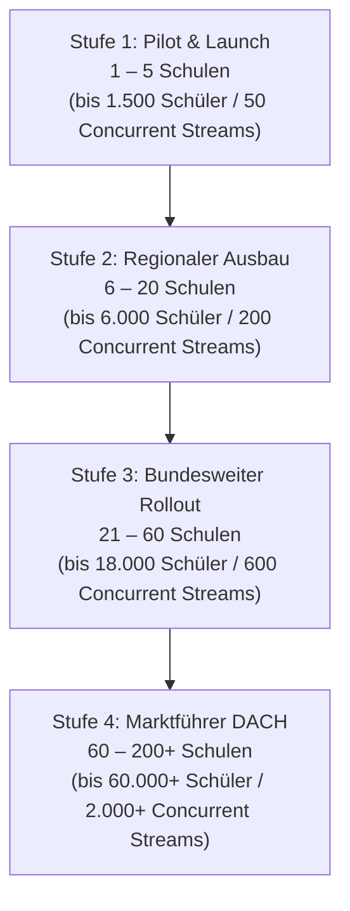

# 📊 Forensische IST-Bestandsaufnahme & Audio-Skalierungsplan
**Plattform:** Campus-Groovelab (https://campus-groovelab.de)  
**Datum:** 25. September 2026  
**Ziel:** Roadmap & Kapazitätsplanung zum Marktführer für didaktische Übebegleitung & Audio-Streaming

---

## 1. Forensische IST-Bestandsaufnahme (Live-Infrastruktur)

### 1.1 Host- & Hardware-Metriken (Hetzner Falkenstein `fsn1`)
* **Instanz-Typ:** Hetzner Cloud `CX23` (Shared Resources, x86 Intel/AMD)
* **Kerne:** 2 vCPUs
* **RAM:** 3,7 GiB physisch (davon **2,0 GiB belegt**, **1,8 GiB verfügbar**)
* **Swap-Airbag:** 4,0 GiB NVMe (`/swapfile`), aktuell **648 MB aktiv genutzt**
* **Lokaler Speicher:** 38 GB NVMe (`/dev/sda1`), 22 GB belegt, **15 GB frei (60 %)**
* **Zusatz-Speicher:** 14 GB Hetzner Cloud Volume (`/mnt/HC_Volume_105951580`), davon **545 MB belegt**
* **Dienste (18 Docker-Container):**
  * `supabase-db` (PostgreSQL 15 Core Engine)
  * `supabase-storage` (Node.js Asset Manager)
  * `supabase-kong` (API-Gateway / SSL / Rate Limiting)
  * `supabase-auth`, `supabase-rest` (PostgREST), `supabase-realtime`
  * `groovelab-bff` (Node.js Backend-for-Frontend)
  * `coolify` Suite (Orchestrierung, Redis, Proxy, Sentinel)
* **Live-Status:** Alle 18 Container laufen seit **12 Tagen unterbrechungsfrei** (`healthy`).

### 1.2 Forensische Audio-Codebase-Analyse
Die Audio-Features sind im Codebase bereits tief verankert und nutzen moderne Web-Standards:
* **Audio-Aufnahme-Module:**
  * `GrooveLoopstation.tsx` (Mehrspur-Loopstation, parallele Spuren)
  * `GroovePracticeCompanion.tsx` (Übebegleiter mit Hardware-Stream-Bypass gegen Safari-Drift)
  * `useMeisterwerkAudioRecording.ts` & `DuettDeckModal.tsx` (Schüler-Lehrer-Aufnahmen)
  * `AudioMemoRecorder.tsx` (Schnelle Sprach-/Audio-Notizen für Hausaufgaben)
* **Formate & Bitraten:**
  * Primär: `audio/webm;codecs=opus` (Chromium/Android)
  * Fallback: `audio/mp4` / `audio/aac` (iOS Safari)
  * Bitraten: **128 kbit/s** (Sprachmemos / Basisübungen) bis **256 kbit/s** (Loopstation / Mastering)
* **Aktueller Datenfluss (IST-Zustand):**
  * Uploads wandern über `audioStorageHelper.ts` in die Supabase-Buckets `campus-assets` und `groovelab-assets`.
  * **Flaschenhals im IST-Zustand:** Die Audio-Dateien liegen aktuell auf dem **Ceph-Netzwerk-Volume** (`/mnt/HC_Volume_.../supabase-storage`) und werden bei jedem Playback über **Kong -> supabase-storage -> Server-CPU** gestreamt.

---

## 2. Serverlast-Evaluation bei Audio-Betrieb

### 2.1 Technische Kennzahlen pro Audio-Vorgang
* **1 Minute Audio (128 kbit/s Opus):** $\approx 0,96\text{ MB}$ Dateigröße
* **3 Minuten Übe-Take (128 kbit/s):** $\approx 2,9\text{ MB}$ Dateigröße
* **3 Minuten High-Quality Song (256 kbit/s):** $\approx 5,8\text{ MB}$ Dateigröße
* **Bandbreite pro aktiver Wiedergabe (Streaming):** $\approx 16\text{ bis }32\text{ KB/s}$ ($0,13\text{ bis }0,26\text{ Mbit/s}$)

### 2.2 Lastprofil nach Anzahl gleichzeitiger Audio-Streams

| Gleichzeitige Hörer/Streamer | Bandbreite (Download) | Disk Read I/O | RAM-Bedarf (Stream-Puffer) | CPU-Last auf CX23 (2 Cores) | Auswirkung auf Nutzer |
| :---: | :---: | :---: | :---: | :---: | :--- |
| **5 Streams** | 1,3 Mbit/s | ~0,15 MB/s | ~15 MB | ~5 – 10 % | Glasklar, verzögerungsfrei |
| **25 Streams** | 6,5 Mbit/s | ~0,80 MB/s | ~80 MB | ~25 – 35 % | Stabil |
| **50 Streams** | 13,0 Mbit/s | ~1,60 MB/s | ~160 MB | **~60 – 75 %** | Erste Latenzen bei parallelen DB-Queries |
| **100 Streams** | 26,0 Mbit/s | ~3,20 MB/s | ~350 MB | **> 95 % (Limit!)** | **Audio-Ruckler, Pufferpausen!** |
| **250 Streams** | 65,0 Mbit/s | ~8,00 MB/s | ~900 MB | **100 % (Kollaps)** | Verbindungsabbrüche, 504 Gateway Timeouts |

### 2.3 Warum der CX23 bei 50+ gleichzeitigen Streams an die Grenze kommt
1. **Kong SSL-Terminierung & Auth-Signatur:** Jeder Audio-Chunk läuft durch Kong und prüft HMAC/JWT. Bei 100 Streams erzeugt das permanente Krypto-Last auf den 2 vCPUs.
2. **Ceph-Netzwerk-Latenz:** Zufällige parallele Lesezugriffe auf das Hetzner Cloud Volume erzeugen Latenzen von 5–20 ms, was bei HTTP 206 Range Requests zu hörbaren Aussetzern führt.
3. **Konsequenz:** Für 1–2 Schulen reicht der CX23. Sobald 3+ Schulen nachmittags zwischen 15:00 und 18:00 Uhr parallel üben, bricht die Audio-Qualität auf Shared vCPUs ein.

---

## 3. Skalierungsplan: Schulen & Nutzer

### 3.1 Das Musikschul-Nutzungsmodell (Empirische Basis)
* **1 durchschnittliche Musikschule:**
  * 300 Schüler, 25 Lehrkräfte
  * Aktive Schüler pro Tag: ca. 60 – 90 Schüler (ca. 20–30 %)
  * **Peak-Stunde (15:00 – 18:00 Uhr):** Ca. 15 – 25 Schüler üben oder hören Aufnahmen **zeitgleich**.
  * Audio-Datenvolumen pro Schule: ca. **2 bis 5 GB Neudaten / Monat**.

---

### 3.2 Die 4 Skalierungsstufen

---

#### 🟢 Stufe 1: Pilot & Launch (1 bis 5 Schulen)
* **Schüler gesamt:** 300 bis 1.500
* **Gleichzeitige Nutzer (Peak):** 50 bis 120
* **Gleichzeitige Audio-Streams:** **15 bis 50**
* **Audio-Speicherbedarf:** ~25 GB (im ersten halben Jahr)
* **Server-Anforderung:**
  * **CPU:** 4 vCPUs (Dediziert bevorzugt, kein CPU-Steal)
  * **RAM:** 8 GB DDR5 ECC
  * **Festplatte:** 256 GB lokale NVMe (< 0,1 ms I/O)
* **Empfohlene Hardware:** **Netcup Root-Server RS 1000 G11** (~ 16,00 €/mo) oder Hetzner CX43 (~ 19,00 €/mo).
* **Fixkosten:** **~ 16 – 20 € / Monat**

---

#### 🟡 Stufe 2: Regionaler Ausbau (6 bis 20 Schulen)
* **Schüler gesamt:** 1.800 bis 6.000
* **Gleichzeitige Nutzer (Peak):** 200 bis 500
* **Gleichzeitige Audio-Streams:** **60 bis 200**
* **Audio-Speicherbedarf:** ~100 bis 250 GB
* **Architektur-Schritt:** Einführung von **Audio Edge Caching / Direct Storage Streaming** (BunnyCDN oder Cloudflare R2 / Hetzner Storage). Dadurch wird die Audio-Last zu 90 % vom App-Server entkoppelt!
* **Server-Anforderung:**
  * **CPU:** 8 dedizierte Kerne (AMD EPYC)
  * **RAM:** 16 GB DDR5 ECC
  * **Festplatte:** 512 GB lokale NVMe
* **Empfohlene Hardware:** **Netcup Root-Server RS 2000 G11** (~ 25,00 €/mo) + Hetzner Storage Box 1 TB (3,81 €/mo).
* **Fixkosten:** **~ 29 – 35 € / Monat**

---

#### 🟠 Stufe 3: Bundesweiter Rollout (21 bis 60 Schulen)
* **Schüler gesamt:** 6.300 bis 18.000
* **Gleichzeitige Nutzer (Peak):** 600 bis 1.500
* **Gleichzeitige Audio-Streams:** **200 bis 600**
* **Audio-Speicherbedarf:** ~500 GB bis 1,5 TB
* **Server-Anforderung:**
  * **CPU:** 8–16 physische Cores (Dedicated Bare Metal)
  * **RAM:** 32 bis 64 GB ECC-RAM
  * **Festplatte:** 2x 1.000 GB NVMe (Software RAID-1)
* **Empfohlene Hardware:** **Hetzner Dedicated Server (Serverbörse)** (z. B. Intel i7-8700 / AMD Ryzen 5, 64 GB RAM für ~ 38,00 – 44,00 €/mo) + Audio-CDN.
* **Fixkosten:** **~ 45 – 55 € / Monat**

---

#### 🔴 Stufe 4: Marktführer DACH (60 bis 200+ Schulen)
* **Schüler gesamt:** 20.000 bis 60.000+
* **Gleichzeitige Nutzer (Peak):** 2.000 bis 5.000
* **Gleichzeitige Audio-Streams:** **600 bis 2.500**
* **Audio-Speicherbedarf:** 2 TB bis 8 TB
* **Enterprise High-Availability Setup:**
  * **Node 1 (Primärer App- & DB-Host):** Dedicated Bare-Metal (64 GB RAM, AMD EPYC/Ryzen)
  * **Node 2 (Read-Replika & Fallback):** Dedicated Bare-Metal (64 GB RAM)
  * **Audio-Infrastruktur:** 100 % Direct-to-S3 Uploads & deutsches Edge-CDN (Frankfurt/Nürnberg). Audio berührt die App-Server nicht mehr.
* **Gesamte Infrastrukturkosten:** **~ 90 – 140 € / Monat**
* **Verhältnis zum Umsatz:** Bei 100 Schulen à ca. 99 €/mo beträgt der Monatsumsatz ~10.000 €. Die Serverkosten liegen bei **unter 1,5 % des Umsatzes**!

---

## 4. Wirtschaftlichkeits- & Skalierungsmatrix

| Metrik | Stufe 1 (1–5 Schulen) | Stufe 2 (6–20 Schulen) | Stufe 3 (21–60 Schulen) | Stufe 4 (60–200 Schulen) |
| :--- | :---: | :---: | :---: | :---: |
| **Schüleranzahl** | bis 1.500 | bis 6.000 | bis 18.000 | 60.000+ |
| **Audio-Streams (Peak)** | 15 – 50 | 60 – 200 | 200 – 600 | 600 – 2.500 |
| **Empfohlene Instanz** | Netcup RS 1000 | Netcup RS 2000 | Hetzner Dedicated | 2x Dedicated + CDN |
| **Kerne (Dediziert)** | 4 Cores | 8 Cores | 8–12 Cores (physisch) | 24+ Cores (Cluster) |
| **RAM** | 8 GB ECC | 16 GB ECC | 64 GB ECC | 128 GB ECC |
| **SSD (Lokal)** | 256 GB NVMe | 512 GB NVMe | 2x 1 TB NVMe | 4x 1 TB NVMe |
| **Server-Kosten / Monat** | **~ 16 €** | **~ 29 €** | **~ 45 €** | **~ 110 €** |
| **Möglicher SaaS-Umsatz** | 300 – 1.000 € | 1.500 – 4.000 € | 5.000 – 15.000 € | 20.000 – 50.000 € |
| **Infrastruktur-Quote** | **< 4 %** | **< 1,5 %** | **< 0,8 %** | **< 0,3 %** |

---

## 5. Konkrete Handlungsempfehlungen für den Marktführer-Pfad

1. **Der nächste logische Schritt vor Kundenzulauf:**
   * Wechsel vom überbuchten 6,53 € Hetzner-Shared-Server auf einen **Root-Server mit dedizierten Kernen (z. B. Netcup RS 1000 für ~16 €/mo)**.
   * Damit gehören euch 4 echte CPU-Kerne und 8 GB RAM zu 100 %. Keine Latenzschwankungen, kein Audio-Stottern.
2. **Aufhebung des Cloud-Volumen-Flaschenhalses:**
   * Die Daten von `/mnt/HC_Volume_...` wandern direkt auf die lokale NVMe des neuen Servers (< 0,1 ms Latenz).
   * Die Hetzner Storage Box (1 TB für 3,81 €) bleibt als georedundanter Backup-Tresor in Falkenstein aktiv.
3. **Audio-Entkopplung bei Erreichen von Stufe 2:**
   * Sobald 10+ Schulen an Bord sind, aktivieren wir das direkte Streaming über ein Edge-CDN. Damit skaliert die Plattform mühelos bis in sechsstellige Nutzerzahlen, ohne dass die Serverkosten explodieren.
