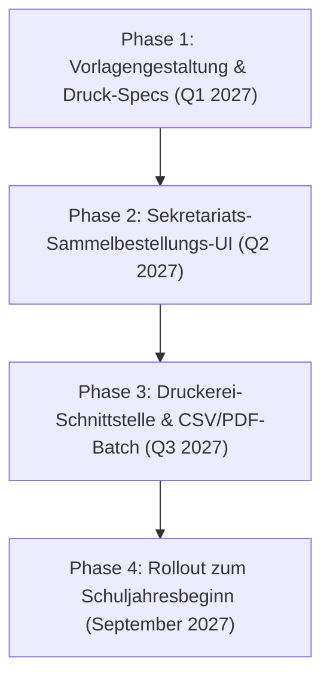

# 📦 0,1% Goldstandard Roadmap: Das Physische Campus-Groovelab Starter-Set (10 €)

> **Klassifizierung:** Strategie, Unit Economics, Logistik & B2B-Roadmap  
> **Status:** Genehmigte Roadmap-Initiative (Punkt 1.1)  
> **Ziel:** Physisches Starter-Paket für Musikschulanfänger zum Schuljahresbeginn (September/Oktober)  
> **Verkaufspreis:** 10,00 € brutto (8,40 € netto bei 19 % USt)

---

## 1. Produkt-Definition & Inhalt des Starter-Sets

Das Starter-Set schließt die haptische Brücke zwischen digitaler Didaktik und dem physischen Unterrichtsraum:

| Komponente | Spezifikation | Didaktischer & Praktischer Nutzen |
| :--- | :--- | :--- |
| **1. Edle Notenmappe / Ringbuch (A4)** | Hochwertiger schwarzer Matt-Karton (350 g/m²) mit mattem Softtouch-Lack, 2-Ring-Mechanik und dezentem Blindprägedruck *Campus-Groovelab*. | Hält physische Notenblätter, Songtexte und Skizzen geordnet. Verhindert Zettelwirtschaft im Instrumentenkoffer. |
| **2. Noten- & Aufgabenblock (A4, 50 Blatt)** | 90 g/m² holzfreies Naturpapier, beidseitig bedruckt: Obere Hälfte 5-Linien-Notensysteme, untere Hälfte linierte Felder für didaktische Hausaufgaben-Notizen und Wochendaten. | Analoges Mitschreiben im Präsenzunterricht ohne Verzögerung. Perfekte Ergänzung zum digitalen Aufgabenheft. |
| **3. Schulausweis (Plastikkarte)** | Robuste Bio-PETG-/PVC-Karte (0,76 mm CR80, Scheckkartenformat). Hochauflösender Offsetdruck mit Namen, Instrument, Kanonischer Campus-ID (`CAM-85: 001-S-0001`), QR-Code und rubbelfester PIN-Rückseite. | Ermöglicht 1-Sekunden-Login an Klassen-Tablets, Kiosk-Terminals und Smartphones. Null Passwörter für Kinder. |
| **4. Koffer-Tag mit Notfall-Code (`CAM-111`)** | Bruchfester Silikon-/Acryl-Anhänger für den Instrumentenkoffer mit Edelstahl-Schraubschlaufe. Beidseitiger QR-Code. | **Verlustschutz gem. `CAM-111`**: Findet jemand das Instrument, führt der Scan direkt zur offiziellen Schulkontaktkarte (Zero PII). Sekretariat kann das Instrument mit 1 Scan zuordnen. |
| **5. Instrumenten-Stickerbogen (A6)** | UV-lackierte, rückstandsfrei ablösbare Vinyl-Sticker (monochrome Instrumenten-Icons, GrooveLab-Flamme, Smaragd-Häkchen). | Personalisierung des Instrumentenkoffers oder Notenständers; kindgerechte Motivation. |

---

## 2. Kaufmännische Kalkulation (Unit Economics & Deckungsbeitrag)

### 2.1. Einkauf & Produktionskosten (COGS bei Staffel 2.500 Stück)

| Position | Lieferant / Verfahren | Kosten netto |
| :--- | :--- | :---: |
| Notenmappe A4 Ringbuch | Druckerei (z. B. Flyeralarm / Schlender Mappen) | 1,85 € |
| Noten- & Aufgabenblock A4 (50 Blatt) | Offsetdruck auf 90g Naturpapier | 0,85 € |
| Schulausweis Plastikkarte (CR80) | Plastikkarten-Druckerei (inkl. Personalisierung) | 0,42 € |
| Gepäck-/Koffer-Tag mit Metallschlaufe | Acryl/Silikon-Fertigung (Laserdruck/Siebdruck) | 0,55 € |
| Vinyl-Stickerbogen A6 | UV-Digitaldruck gestanzt | 0,18 € |
| Transparente Banderole & Konfektionierung | Konfektionierungsbetrieb / Eigenleistung | 0,35 € |
| **Gesamte reine Herstellkosten (COGS) pro Set** | | **4,20 € netto** |

---

### 2.2. Die Logistik-Falle vs. Das 0,1% B2B-Sammelversand-Axiom

> [!CAUTION]
> **Die B2C-Logistikfalle:**  
> Würden wir jedes Starter-Set einzeln an die Wohnadresse der Eltern schicken:
> * DHL-Paket / Großbrief mit Prio: 3,99 € – 5,49 €
> * Einzelverpackung & Versandtasche: 0,70 €
> * Logistikkosten pro Set = **4,69 € – 6,19 €**!  
> * **Ergebnis bei 8,40 € Nettoerlös:** 8,40 € – 4,20 € (Ware) – 5,40 € (Versand) = **-1,20 € VERLUST pro Set!**

#### Die 0,1% Goldstandard-Lösung: B2B-Sammelpaket an die Schule

1. **Bestellfenster zum Schuljahresbeginn (Juli – September):**  
   Die Musikschule meldet über das Sekretariats-Cockpit ihren Bedarf an (z. B. 60 Starter-Sets für alle Neuanmeldungen des Schuljahres).
2. **Gebündelte Produktion & 1 Sammelpaket:**  
   Die 60 Sets werden in einem einzigen stabilen Karton per DHL an das Musikschulsekretariat geliefert (Portokosten: ca. 8,50 € gesamt $\to$ **nur 0,14 € Portoanteil pro Set!**).
3. **Persönliche Übergabe im Unterricht:**  
   Am ersten Schultag erhält der Schüler seine personalisierte Mappe und seinen Ausweis direkt von seiner Lehrkraft. Dies schafft sofort eine emotionale Bindung zur Musikschule.

---

### 2.3. Margen- und Gewinn-Bilanz

```
┌────────────────────────────────────────────────────────────────────────┐
│              DECKUNGSBEITRAGS-RECHNUNG PRO 10-EURO-STARTER-SET         │
├────────────────────────────────────────────────────────────────────────┤
│ Endpreis für Eltern / Schule (brutto):                       10,00 €   │
│ Abzüglich 19 % Umsatzsteuer:                                 -1,60 €   │
│ = Netto-Verkaufserlös:                                        8,40 €   │
│                                                                        │
│ Abzüglich Herstellkosten (Mappe, Block, Ausweis, Tag, Sticker): -4,20 € │
│ Abzüglich B2B-Sammelporto-Anteil:                            -0,15 €   │
│ ────────────────────────────────────────────────────────────────────── │
│ = REINGEWINN (DECKUNGSBEITRAG II) PRO SET:                    4,05 €   │
│                                                                        │
│ 🚀 ROHMARGE (BEZOGEN AUF NETTOERLÖS):                        +48,2 %   │
└────────────────────────────────────────────────────────────────────────┘
```

#### Hochrechnung auf Schulgrößen:
* **Kleine Musikschule (150 Schüler / 40 Neuanmeldungen):**  
  $40 \times 4,05\text{ €} = \mathbf{162,00\text{ € Netto-Zusatzgewinn}}$
* **Mittelgroße Musikschule (600 Schüler / 180 Neuanmeldungen):**  
  $180 \times 4,05\text{ €} = \mathbf{729,00\text{ € Netto-Zusatzgewinn}}$
* **Große Musikschule / Zweckverband (2.000 Schüler / 500 Neuanmeldungen):**  
  $500 \times 4,05\text{ €} = \mathbf{2.025,00\text{ € Netto-Zusatzgewinn}}$

---

## 3. Warum Eltern und Musikschulleitungen das Set lieben

1. **Enormer Preisvorteil für Eltern**:  
   Im stationären Fachhandel kostet eine hochwertige Notenmappe ca. 8,00–14,00 €, ein Notenblock 4,50–7,00 € und ein Koffer-Anhänger 4,00 €. Das Starter-Set bietet ein vollwertiges Profi-Paket für **nur 10,00 €**.
2. **Zero Aufwand für die Musikschule**:  
   Schulen müssen Ausweise nicht selbst drucken oder laminieren. Sie erhalten fertige, professionell personalisierte Mappen.
3. **Schutz vor Instrumentenverlust (`CAM-111`)**:  
   Der Koffer-Tag bietet Eltern die beruhigende Sicherheit, dass ein im Schulbus oder Park vergessenes Instrument (oft im Wert von 500 € bis 3.000 €) schnell und diskret über das Schulsekretariat zurückgeführt werden kann.

---

## 4. Technische Implementierungs-Roadmap



1. **Phase 1 (Druckvorlagen)**:
   - Erstellung der Vektor-Druckvorlagen für Notenmappe (A4), Notenblock (5-Linien-Raster + didaktischer Notizteil) und Stickerbogen.
2. **Phase 2 (Sekretariats-Cockpit Modul)**:
   - Ergänzung im Reiter *Verwaltung / Lizenzen* (`SecretaryLicensesView.tsx`):
     Button `[ 📦 Starter-Sets für neues Schuljahr vorbestellen ]`.
   - Automatische Vorauswahl aller neu angelegten Schüler ohne bisherigen Ausweisdruck.
3. **Phase 3 (Karten- & Ausweis-Batch-Export)**:
   - Export-Engine zur Generierung druckfertiger Druckbogen (Vorderseite Schüler-Layout, Rückseite QR-Code mit Ausweis-PIN).
4. **Phase 4 (Lieferung & Rollout)**:
   - Sammelversand an Schulen pünktlich 14 Tage vor Unterrichtsbeginn nach den Sommerferien.
