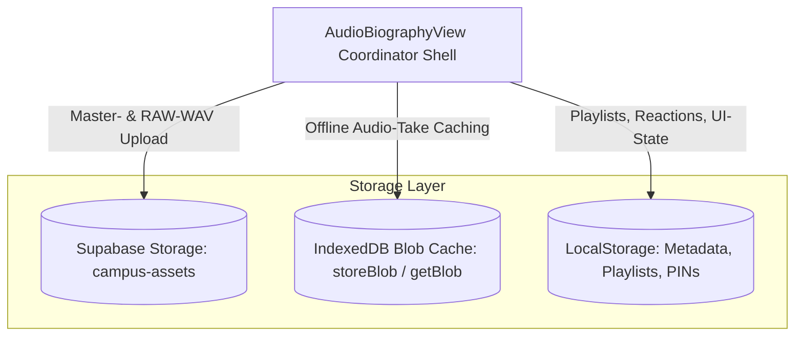

# 🏛️ FORENSIC BASELINE AUDIT: AUDIO BIOGRAPHY VIEW (`AudioBiographyView.tsx`)
**Dokument-ID**: `FORENSIC_BASELINE_AUDIO_BIOGRAPHY_VIEW`  
**Autor**: Principal Software Forensic Auditor & SaaS Reverse-Engineering Specialist  
**Datum**: 2026-09-19  
**Status**: Verbindliche Baseline vor Dekomposition (1:1 Paritäts-Garantie)  
**Quell-Datei**: [`apps/groovelab/src/components/campus/AudioBiographyView.tsx`](file:///Users/patrickhuber/Documents/Antigravity%20Projects/Groovelab%20app/apps/groovelab/src/components/campus/AudioBiographyView.tsx)  
**Umfang vor Dekomposition**: **12.940 Zeilen (LOC)** | 565.678 Bytes  

---

## 1. 🎯 Executive Summary & Zweck des Audits

`AudioBiographyView.tsx` ist das zentrale didaktische Audio-Portfolio und musikalische Archiv der Plattform **Campus-Groovelab**. Es verbindet hochkomplexe Web-Audio-Signalverarbeitung (Studio-Dual-Mastering nach EBU R128 / ITU-R BS.1770, Echtzeit-Faltungshall, Reverb-Profile), persistente Multi-Storage-Architektur (Supabase Cloud Storage `campus-assets`, IndexedDB Blob-Cache, LocalStorage Metadata) und interaktive Visualisierungen (Vinyl-Shelf, Turntable, Spotify-Style Cover-Art, 10 Meilensteine, Junior-Wizard).

Dieses Dokument erfasst alle funktionalen Schichten, Zustände, Audio-Engines und Modaldialoge, um bei der anstehenden Dekomposition in **modulare Subkomponenten und Hooks (< 350 LOC)** einen **100%igen Regressionsschutz** zu garantieren.

---

## 2. 🔌 Externe Schnittstelle & Props Contract

```typescript
export interface AudioBiographyViewProps {
  student: any;                                     // Schüler-Objekt (id, school_id, campus_ui_level, etc.)
  teacherId?: string;                               // Optional: ID der zugeordneten Lehrkraft
  isTeacher?: boolean;                              // Modus: true = Lehrer-Ansicht, false = Schüler/Eltern
  onBackToHub: () => void;                          // Navigations-Rücksprung zum Campus-Dashboard
  isMobileOrSim?: boolean;                          // Responsive Flag (Mobile / Simulator)
  studentUiLevel?: 'junior' | 'teen' | 'pro' | null;// Didaktischer UI-Level (Overrule für Junior)
}
```

### Abwärtskompatibilitäts-Garantie:
Der Export `export const AudioBiographyView: React.FC<AudioBiographyViewProps>` bleibt am exakten Dateipfad [`apps/groovelab/src/components/campus/AudioBiographyView.tsx`](file:///Users/patrickhuber/Documents/Antigravity%20Projects/Groovelab%20app/apps/groovelab/src/components/campus/AudioBiographyView.tsx) erhalten. Eltern-Komponenten (`CampusDashboard.tsx`, `TeacherDashboard.tsx`, `StudentDashboard.tsx`) bedürfen **keiner** Import-Änderung.

---

## 3. 🎛️ Audio Pipeline & Mastering Invarianten

Die Audio-Engine transformiert Rohaufnahmen in bühnenreifes Master-Audio. Folgende technische Axiome sind unantastbar:

| Parameter | Studio Master | Pure RAW | Standard / Vorschrift |
|---|---|---|---|
| **Target Integrated Loudness** | `-14.0 LUFS` (`TARGET_STUDIO_LUFS`) | `-18.0 LUFS` (`TARGET_PURE_RAW_LUFS`) | EBU R128 / Streaming Normalization |
| **True Peak Limiting** | `-1.0 dBTP` (`TARGET_PEAK_DBTP`) | `-1.0 dBTP` | Inter-Sample Peak Distortion Prevention |
| **Format** | 48kHz / 16-Bit Stereo WAV (`ensureWavBlob`) | 48kHz / 16-Bit Mono/Stereo WAV | CD-/Broadcast-Qualität |
| **Faltungshall (Reverb Rooms)** | 5 Raumakustik-Profile (`ROOM_ACOUSTIC_PROFILES`): `cathedral`, `concert_hall`, `studio_booth`, `wooden_church`, `warm_livingroom` | Trocken / Bypass | `audioMasteringEngine.ts` |
| **Dual-Mastering Result** | `DualMasteringResult` liefert synchron `masterBlob` und `rawBlob` | Parallel erzeugt | Schneller A/B-Hörvergleich im UI |
| **WebM Duration Patching** | `fixWebmDuration` zwingend für alle Browser-Aufnahmen | N/A | Korrektur des fehlerhaften Duration-Headers in Chromium/Safari |
| **Audio-Hardware Unlock** | `acquireAudioStream` mit `PURE_RAW_AUDIO_CONSTRAINTS` & `stabilizeAudioStream` | N/A | iOS Safari AudioContext Unlock & EchoCancellation Bypass |

---

## 4. 🗄️ Daten- & Speicher-Topologie (Tri-Storage Architektur)

Die Persistenz von `AudioBiographyView` ruht auf drei synchronisierten Säulen:



1. **Supabase Cloud Storage (`campus-assets`)**:
   - `buildCanonicalAudioStoragePath(schoolId, studentId, takeId, 'master' | 'raw')`
   - Upload mit `contentType: 'audio/wav'`, `upsert: true`
   - Generierung von Public bzw. Signierten URLs via `getSecureAudioUrl`.
2. **IndexedDB Blob-Storage (`storeBlob`, `getBlob`, `deleteBlob`)**:
   - Schnelles lokales Abspielen ohne Cloud-Roundtrip und lückenlose Offline-Nutzung.
3. **LocalStorage Schlüssel**:
   - `campus_audio_milestones_${studentId}`: 10 Meilensteine mit Audio-Referenzen und Notizen.
   - `campus_audio_playlists_${studentId}`: Benutzerdefinierte Playlists und Album-Strukturen.
   - `campus_share_pin_${studentId}` / `campus_share_pin_current`: Familien-Freigabe PINs.
   - `campus_reactions_${targetKey}_${id}`: Eltern- und Lehrer-Reaktionen (Emojis, Likes).
   - `campus_mastery_complete_${studentId}`: Flag für den Abschluss aller 10 Meilensteine.
   - `campus_student_meta_${studentId}` / `campus_school_name`: Schulstammdaten-Cache.

---

## 5. 🪟 Modaldialoge & Slide-Over Drawers (14 Komponenten)

In `AudioBiographyView.tsx` sind 14 komplexe Dialoge und Overlays enthalten, die in dedizierte Leaf-Komponenten ausgelagert werden:

1. **`SchoolYearFolderModal`** (Zeile 5.759): LP-Ordner des Schuljahres, A/B-Seiten-Tracklist, Album-Cover.
2. **`LinerNotesModal`** (Zeile 6.058): Booklet mit Liedtexten, Entstehungsgeschichte, Notizen der Lehrkraft.
3. **`FloatingMiniPlayer`** (Zeile 6.397): Fester Bottom-Mini-Player mit Waveform, Scrubbing, Play/Pause, Loop, Lautstärke.
4. **`PlaylistWizardModal`** (Zeile 9.409): 3-stufiger Apple-Modal Wizard zum Anlegen neuer Playlists.
5. **`AudioRecordingUploadModal`** (Zeile 9.951): Mikrofon-Aufnahme mit Countdown, Pegelanzeige, DAW-Datei-Dropzone & Mastering-Trigger.
6. **`MilestoneReflectionModal`** (Zeile 10.806): Schüler-Reflexionsdialog mit Notizen, Sticker-Auswahl und Selbstbewertung.
7. **`ShareModal`** (Zeile 10.902): Familien-Freigabe mit privatem Web-Link, PIN-Schutz und Zwischenablage-Kopie.
8. **`DualVersionDownloadModal`** (Zeile 11.303): Download-Menü (Studio Master WAV, Pure RAW WAV oder ZIP-Archiv via JSZip).
9. **`TrackEditModal`** (Zeile 11.474): Metadaten-Editor (Titel, Interpret, Reverb-Raum, Aufnahmejahr, private Notiz).
10. **`DeleteTrackConfirmModal`** (Zeile 11.936): Sicherheitsabfrage vor destruktiver Löschung aus Cloud und IndexedDB.
11. **`JuniorAudioBiographyWizard`** (Zeile 12.065): Integrierter didaktischer Assistent für Kinder.
12. **`JuniorAlbumModal`** (Zeile 12.070): Kindgerechte Albumansicht mit großen Touch-Zielen und bunten Badges.
13. **`JuniorCreatePlaylistModal`** (Zeile 12.433): Vereinfachte Playlist-Erstellung für Kinder.
14. **`MasteryCompleteModal`** (Zeile 12.771): Feierliches Jubiläums-Modal mit `react-confetti` beim Erreichen von Meilenstein 10.

---

## 6. 🎨 Ansichten & Layout-Modi

1. **`JuniorAudioHub`** (`studentUiLevel === 'junior'`):
   - Farbiges, verspieltes Interface mit großen Squircles, kindgerechter Typografie, Comic-Badges und Audio-Stickern.
2. **`OverviewShelf`** (Standard-Übersicht):
   - Spotify-Style Album-Cards nach Schuljahren sortiert (`activeSchoolYears`).
   - Vertikale und horizontale LP-Regal-Visualisierung.
3. **`VinylShelf`** (Interaktives Vinyl-Regal & Turntable):
   - 3D-inspirierte Schallplatten-Animation, Nadel-Aufsetzen, rotierende Vinyl-Disc bei aktiver Wiedergabe.
4. **`MilestonesTab`** (Meilenstein-Reise):
   - 10 didaktische Stationen von „Meine erste Note“ bis „Mein großes Meisterstück“ mit Fortschrittsbalken und Status-Icons.
5. **`PlaylistsTab`** (Playlists & Sampler):
   - Pädagogische Vorlagen (`PEDAGOGICAL_PLAYLIST_TEMPLATES`) und freie Playlists mit Vibe-Themes (`VIBE_THEMES`).

---

## 7. ✅ 1:1 Paritäts- & Verifikations-Checkliste

Nach der Dekomposition MÜSSEN folgende Tests ausnahmslos positiv ausfallen:

- [ ] **CHKL-01: Props & Initialisierung**  
  `AudioBiographyView` rendert fehlerfrei für Schüler (`isTeacher = false`) und Lehrkräfte (`isTeacher = true`), mit und ohne `studentUiLevel`.
- [ ] **CHKL-02: Junior-Modus Schalter**  
  Wenn `studentUiLevel === 'junior'` oder `localStorage.getItem('campus_ui_level') === 'junior'`, wird automatisch der `JuniorAudioHub` geladen.
- [ ] **CHKL-03: Audio-Aufnahme (Live-Mic)**  
  Mikrofon-Berechtigung wird über `acquireAudioStream` geholt. Countdown läuft (3, 2, 1). Timer tickt im Sekundentakt. Wellenform schlägt aus.
- [ ] **CHKL-04: Studio Dual-Mastering**  
  Nach Aufnahme-Stopp wird `processDualMastering` ausgeführt. Lautheit wird auf `-14 LUFS` normalisiert. True-Peak wird auf `-1.0 dBTP` begrenzt.
- [ ] **CHKL-05: Cloud & IndexedDB Persistenz**  
  Master- und RAW-Blobs werden in IndexedDB (`storeBlob`) gesichert und synchron in Supabase Storage `campus-assets` hochgeladen.
- [ ] **CHKL-06: A/B-Hörvergleich**  
  Im Player kann unterbrechungsfrei zwischen `master` und `raw` umgeschaltet werden.
- [ ] **CHKL-07: Vinyl-Shelf & Turntable**  
  Schallplatte dreht sich bei Wiedergabe. Tracktitel und Fortschrittszeit stimmen überein.
- [ ] **CHKL-08: 10 Meilensteine Fortschritt**  
  Stationen 1 bis 10 werden korrekt mit Status (gesperrt, offen, aufgenommen, gemeistert) angezeigt. Meilenstein 10 triggert Konfetti.
- [ ] **CHKL-09: Playlists & Vibe-Themes**  
  Erstellung von Playlists mit Farbschema aus `VIBE_THEMES`. Wiedergabewarteschlange (`playbackQueue`) arbeitet alle Tracks sequentiell ab.
- [ ] **CHKL-10: Familien-Freigabe & PIN**  
  Share-Modal generiert Web-Link. PIN wird im LocalStorage synchronisiert.
- [ ] **CHKL-11: ZIP-Export & Download**  
  Download-Modal erzeugt über `JSZip` ein valides ZIP-Archiv mit Master-WAV, RAW-WAV und Notizdatei.
- [ ] **CHKL-12: Zero-Secret-Leakage & Typ-Sicherheit**  
  Keine sensiblen Daten im State. Strict TypeScript ohne `any`-Castings in den neuen Modulen.
- [ ] **CHKL-13: Monolith-Goldstandard (< 350 LOC)**  
  Jede neu erstellte Subkomponente und jeder Hook bleibt strikt unter 350 Zeilen Code.
