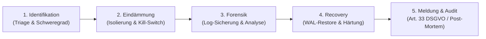

# 🚨 Campus-Groovelab: Incident Response Runbook & DSGVO Art. 33 Meldekette
> **Klassifizierung:** Autoritatives IT-Sicherheits- & Datenschutz-Notfall-Betriebshandbuch (Single Source of Truth)  
> **Rechtsgrundlage:** Art. 33 & 34 DSGVO, BSI IT-Grundschutz, DIN 66398, TKG/TTDSG  
> **Infrastruktur:** Hetzner Cloud / Bare-Metal (`178.105.10.2`) & Hetzner Storage Box  
> **Plattformbezeichnung:** Ausnahmslos **Campus-Groovelab** (mit Doppel-'o')  
> **Letzte Überprüfung:** 2026-09-18 (Phase 4 Goldstandard Release)

---

## 1. Das 5-Phasen-Reaktionsmodell (NIST / BSI Standard)

Bei Verdacht auf eine IT-Sicherheitsverletzung, einen unautorisierten Datenzugriff oder einen Serverausfall greift die unverzügliche Eskalationskette:



---

## 2. Schweregrad-Klassifizierung (Severity Levels)

| Level | Definition | Reaktionszeit | Meldekette |
| :---: | :--- | :---: | :--- |
| **P1 - Kritisch** | **Datenschutzvorfall / Datenleck:** Unbefugter Zugriff auf PII, RLS-Bypass, Einbruch in Server, Totalausfall der Plattform. | **< 15 Minuten** | Sofortige Einberufung Krisenteam; 72h-Uhr nach Art. 33 DSGVO startet unmittelbar. |
| **P2 - Hoch** | **Teilausfall / DoS-Angriff:** Störung des Messengers oder der DAW-Engine; auffällige Brute-Force-Wellen am Auth-Gateway. | **< 1 Stunde** | Server-Firewall Härtung, Fail2Ban-Ban; Information an Schulleitungen bei Behinderung. |
| **P3 - Mittel** | **Lokaler Fehler / Isolierter Bug:** Fehler bei Rechnungs-PDF-Generierung, isolierte UI-Abstürze ohne Datenrisiko. | **< 4 Stunden** | Standard-Hotfix über Git & CI-Pipeline. |
| **P4 - Gering** | Kosmetische Anzeigefehler, Schreibweisen-Korrekturen. | Nächster Sprint | Regulärer Release-Zyklus. |

---

## 3. Sofortmaßnahmen & Emergency Kill-Switches (Phase 2: Eindämmung)

### A. Verdächtige IP-Adresse sofort abriegeln (Egress/Ingress Drop):
```bash
# Sofortige Sperrung am Host-Paketfilter
sudo ufw insert 1 deny from <ANGREIFER_IP> to any
sudo fail2ban-client set recidive banip <ANGREIFER_IP>
```

### B. Notfall-Session-Zeroize (Alle aktiven Tokens & Sitzungen widerrufen):
Über die PostgreSQL-Konsole (`psql` auf Localhost):
```sql
-- Sofortiger Notfall-Reset aller Client-Sessions
UPDATE public.users_raw 
SET token_version = token_version + 1,
    is_active = CASE WHEN role = 'student' THEN is_active ELSE FALSE END;

-- Audit-Eintrag schreiben
INSERT INTO public.audit_logs (action, resource_type, payload)
VALUES ('EMERGENCY_SESSION_TERMINATION', 'security', '{"reason": "P1 Security Breach Containment"}');
```

### C. Plattform in Wartungsmodus versetzen:
In Nginx / Caddy Reverse-Proxy den Wartungsschild aktivieren:
```bash
sudo systemctl reload nginx # Leitet sofort auf statische 503-Maintenance-Page um
```

---

## 4. Behördlicher 72-Stunden-Meldeprozess (Art. 33 DSGVO)

Wird festgestellt, dass personenbezogene Daten (auch maskierte Schülernamen, E-Mails von Lehrkräften oder Logs) unbefugt abgeflossen sind, **MUSS binnen 72 Stunden** eine förmliche Meldung an die zuständige Landesdatenschutzbehörde erfolgen.

### Zuständige Aufsichtsbehörde (Beispiel Baden-Württemberg / Sitz des Betreibers):
* **Behörde:** Der Landesbeauftragte für den Datenschutz und die Informationsfreiheit (LfDI BW)
* **Meldeportal:** https://www.baden-wuerttemberg.datenschutz.de/online-meldung-einer-datenpanne/
* **Telefonischer Bereitschaftsdienst:** +49 (0)711 / 61 55 41 - 0

### Verbindliche Angaben in der Erstmeldung gem. Art. 33 Abs. 3 DSGVO:
1. **Art der Verletzung:** (z. B. unbefugter Zugriff, Abfluss von Log-Dateien, Ransomware).
2. **Kategorien & ungefähre Anzahl der betroffenen Personen:** (z. B. ca. 120 Lehrkräfte und Schulleitungen).
3. **Kategorien & ungefähre Anzahl der Datensätze:** (z. B. E-Mail-Adressen, verschlüsselte Passkey-IDs; **ausdrücklich KEINE Bankdaten, da Zero-Bankdaten-Architektur!**).
4. **Name & Kontaktdaten des Datenschutzbeauftragten:** (Erreichbar für Rückfragen).
5. **Wahrscheinliche Folgen der Verletzung:** (Risikoabschätzung für Betroffene).
6. **Ergriffene oder vorgeschlagene Abhilfemaßnahmen:** (z. B. Trennung der Serververbindung, Token-Revocation, Firewall-Block).

---

## 5. Information der betroffenen Musikschulen & Personen (Art. 34 DSGVO)

* Besteht ein **hohes Risiko** für die persönlichen Rechte und Freiheiten der Nutzer (z. B. Kompromittierung von Chat-Inhalten vor dem 60-Tage-Purge):
  * **Schulleitungen / Schulträger:** Unverzügliche Information per Notfall-E-Mail und Telefon binnen 24 Stunden.
  * **Schüler & Eltern:** Veröffentlichung einer transparenten Mitteilung im Dashboard oder direkte Benachrichtigung durch die Schulleitung.

---

## 6. Wiederherstellung & Disaster Recovery (Phase 4: Recovery)

Im Falle eines Server-Totalschadens oder Datenverlusts:

### A. Point-in-Time-Recovery (PITR) von Hetzner Storage Box:
```bash
# 1. Neuesten verschlüsselten Stand von Storage Box laden
scp -P 23 uXXXXX@uXXXXX.your-storagebox.de:wal_backups/latest_dump.enc /tmp/latest_dump.enc

# 2. Entschlüsseln (AES-256-CBC mit Private Recovery Key)
openssl enc -d -aes-256-cbc -pbkdf2 -in /tmp/latest_dump.enc -out /tmp/restore_db.sql -kfile /root/.backup_secret

# 3. Datenbank-Wiederherstellung
psql -h 127.0.0.1 -U postgres -d postgres -f /tmp/restore_db.sql

# 4. Forensische Integritätsprüfung ausführen
psql -h 127.0.0.1 -U postgres -d postgres -f scripts/security/postgres-catalog-security-audit.sql
```

---

## 7. Post-Mortem & Revisionssichere Dokumentation (Phase 5)

Jeder Sicherheitsvorfall schließt mit einem schriftlichen **Post-Mortem-Untersuchungsbericht** ab:
* Chronologische Zeitleiste (Timeline) minütlich dokumentiert.
* Root-Cause-Analyse (Ursache: Software-Bug, Zero-Day-Exploit, Social Engineering).
* Wirksamkeitsprüfung der getroffenen Gegenmaßnahmen.
* Archivierung des Berichts im Compliance-Tresor für mindestens 5 Jahre nach Art. 33 Abs. 5 DSGVO.
