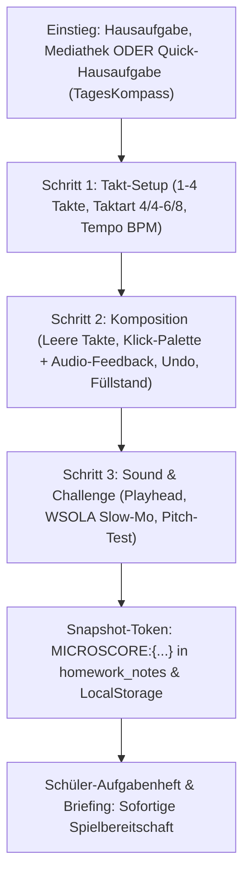

# 🎨 0,1% Goldstandard: Geführter Noten-Baukasten (Step-by-Step Micro-Score Studio 2027)

## 📌 Executive Summary & User Alignment
Die Maske für das Micro-Score Studio wird zu einem **didaktisch geführten 3-Stufen-Baukasten (2027 Apple Studio Standard)** ausgebaut und vollständig in den **Hausaufgaben-Snapshot** und die **Quick-Hausaufgaben** integriert:

1. **Freie Namensvergabe & Lehrwerk-Unabhängigkeit**:
   - Lehrkräfte können Noten-Schnipsel sowohl **völlig frei** (ohne Lehrwerk oder Song, z. B. in der Mediathek, im Lehrer-Dashboard oder als Ad-hoc-Übung) als auch **gekoppelt an eine Hausaufgabe** anlegen.
   - Wenn `taskTitle` vorhanden ist, wird er automatisch als Starttitel gesetzt.
   - Bei freier Erstellung ist das Titelfeld sofort fokussiert und kann völlig frei benannt werden (mit dezenten Vorlagen wie *„Warm-Up 1“*, *„Pentatonik Lick“*, *„Rhythmus-Drill“*).
2. **Schritt 1: Takt-Setup (Takte + Taktart + Tempo + Klangfarbe)**:
   - **Taktanzahl**: Große Apple-Karten für **1, 2, 3 oder 4 Takte** (UrhG § 51 Maximum).
   - **Taktart**: 4/4, 3/4, 2/4, 6/8 als haptische Segment-Wahl.
   - **Tempo**: BPM-Regler mit Schnell-Presets (*60 Adagio, 80 Andante, 100 Moderato, 120 Allegro*).
   - **Klang**: Gitarre (mit 3-Wege-Pill Noten/Tabs), Klavier, Bläser, Streicher.
   - Klick auf `[ Weiter zur Komposition → ]` (oder Klick auf eine Takt-Kachel) führt direkt in Schritt 2.
3. **Schritt 2: Noten-Eingabe mit visueller Klick-Palette & Audio-Vorschau**:
   - Visuelle Klaviatur-Palette (`C`, `D`, `E`, `F`, `G`, `A`, `H`) mit Oktaven 3, 4, 5.
   - Bei Gitarre: Saiten-Picker ($e, B, G, D, A, E$) + Bund-Tasten ($0$ bis $12$).
   - **🎧 Sofortige Hör-Vorschau**: Klick auf eine Note oder einen Bund spielt den Ton sofort für $150\,\text{ms}$ mit authentischem Sound ab.
   - Parallele Tastatureingabe bleibt zu 100% aktiv.
4. **Takte starten 100% LEER**:
   - `notes: []` als Basis für neue Schnipsel. Keine Beispieldaten, keine Lösch-Arbeit.
5. **Ergänzungen für maximale Exzellenz**:
   - **Takt-Mathematik & Füllstand**: Zeigt live die Rest-Zählzeit jedes Takts (z. B. `Takt 1: 3/4 voll · noch 1/4 frei`). Automatischer Sprung in den nächsten Takt bei Vollendung.
   - **Takt-Duplikation**: `[ 📋 Takt 1 kopieren ]` für 1-Klick-Übernahme bei repetitiven Motiven.
   - **Undo / Redo**: `[ ↶ Rückgängig ]` für fehlerfreies Arbeiten.
   - **Takt leeren**: `[ 🗑️ Takt leeren ]` für schnelles Zurücksetzen einzelner Takte.
   - **3-Stufen-Stepper**: `1. Format` $\to$ `2. Komposition` $\to$ `3. Sound & Test`.
   - **Apple Studio Design**: Ruhige Slate-900 / Weiß-Kontraste, 100% unifarbene Tasten, BFSG 2025 / WCAG 2.2 AA.
6. **Hausaufgaben Snapshot & Quick-Hausaufgaben Integration**:
   - **Snapshot-SSOT (`homeworkSnapshotHelper.ts`)**: Kanonischer Token `MICROSCORE:{...}` für verlustfreie Speicherung in `progress_matrix.homework_notes`.
   - **Quick-Hausaufgaben (`TagesKompassSmartInput.tsx` / `TagesKompassLive.tsx`)**: Taktiler Button `[ ♫ Schnipsel ]` direkt in der Smart-Input-Leiste am Unterrichtstag.
   - **Klassen-Zuweisung (`TeacherHomeworkAssignModal.tsx`)**: Checkbox `[x] Noten-Schnipsel einbinden` für 1-Tap Verteilung an Schülergruppen.

---

## 🏛️ Detaillierte Ablauf-Architektur

### Komponenten-Schnittstelle
- [`MicroScoreStudioModal.tsx`](file:///Users/patrickhuber/Documents/Antigravity%20Projects/Groovelab%20app/apps/groovelab/src/components/student/meisterwerk/microscore/MicroScoreStudioModal.tsx):
  - Verwaltet den Stepper-State (`currentStep: 'setup' | 'compose' | 'preview'`).
  - Hält `snippet.notes: []` bei Neuerstellung.
- [`MicroScoreNotePalette.tsx`](file:///Users/patrickhuber/Documents/Antigravity%20Projects/Groovelab%20app/apps/groovelab/src/components/student/meisterwerk/microscore/MicroScoreNotePalette.tsx):
  - Klickbare Notentasten mit Oktav-Wahl (C3–B5) und Gitarren-Bünde (0–12).
  - Spielt Ton via `MicroScoreAudioSynthesizer.scheduleToneAtTime`.
- [`MicroScoreStaffNotation.tsx`](file:///Users/patrickhuber/Documents/Antigravity%20Projects/Groovelab%20app/apps/groovelab/src/components/student/meisterwerk/microscore/MicroScoreStaffNotation.tsx):
  - Rendert Takt-Füllstand über den Takten.
  - Zeigt leere Takte sauber mit Taktstrichen und Caret an.
- [`homeworkSnapshotHelper.ts`](file:///Users/patrickhuber/Documents/Antigravity%20Projects/Groovelab%20app/apps/groovelab/src/utils/homeworkSnapshotHelper.ts):
  - `ParsedMicroScoreItem`, `MICROSCORE:` Token-Parser und Serializer.
- [`TagesKompassSmartInput.tsx`](file:///Users/patrickhuber/Documents/Antigravity%20Projects/Groovelab%20app/apps/groovelab/src/components/teacher/tageskompass/TagesKompassSmartInput.tsx):
  - Schnipsel-Button in der Quick-Hausaufgabenleiste.
