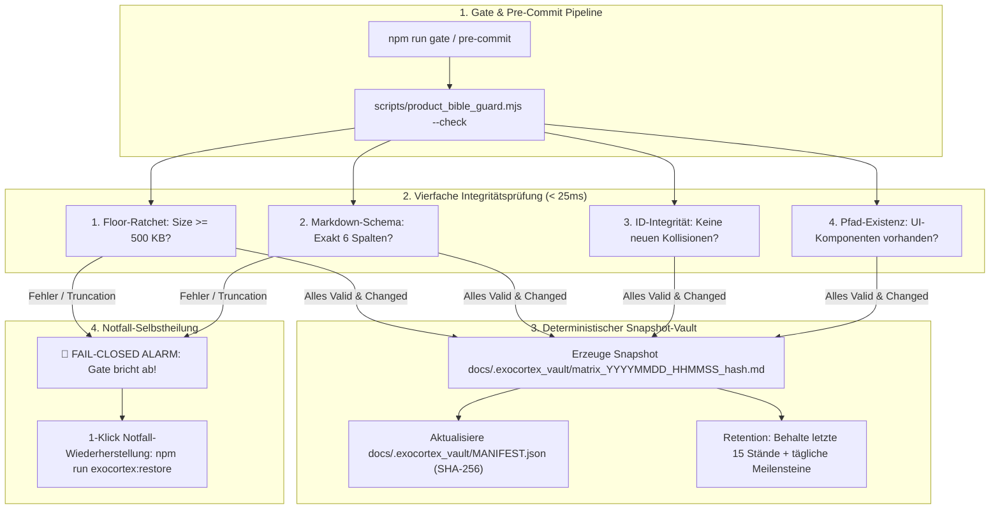

# 🏛️ Implementierungsplan: 0,1% Goldstandard Exocortex-Vault & Product-Bible-Schutzschirm

> **Dokument-ID:** PLAN-2026-10-06-EXOCORTEX-VAULT  
> **Status:** Bereit zur Genehmigung (Genehmigungsvorbehalt gem. AGENTS.md)  
> **Ziel:** Vollständiger, automatisierter Schutz der zentralen Product Bible (`docs/SYSTEM_FEATURE_MATRIX.md`, 522 KB) gegen Truncation, versehentliches Überschreiben durch KI-Agenten, Tabellen-Schema-Korruption und unbemerkten Wissens-Drift.

---

## 1. Ausgangslage & Problemanalyse

Die Datei [`docs/SYSTEM_FEATURE_MATRIX.md`](file:///Users/patrickhuber/Documents/Antigravity%20Projects/Groovelab%20app/docs/SYSTEM_FEATURE_MATRIX.md) ist das autoritative geistige Rückgrat (der "Living Exocortex") von Campus-Groovelab. Mit einer Dateigröße von **522.747 Bytes (~130.000 Tokens)** und 170+ katalogisierten Features ist sie das Fundament für alle didaktischen, rechtlichen und technischen Invarianten.

### Akute Schwachstellen des Status quo:
1. **Truncation-Gefahr durch KI-Tools:** Standard-Dateitools von LLMs truncaten bei 45–64 KB. Ein unbedachter Aufruf von `write_to_file(Overwrite=true)` vernichtet über 450 KB Architektur- und Rechtedokumentation.
2. **Blinder Fleck im Morning Gate:** Das Gate (`npm run gate` / [`scripts/morning_gate_orchestrator.mjs`](file:///Users/patrickhuber/Documents/Antigravity%20Projects/Groovelab%20app/scripts/morning_gate_orchestrator.mjs)) überwacht zwar Codezeilen auf 15-LOC-Genauigkeit, prüft die Product Bible jedoch bisher mit keinem einzigen Guard.
3. **ID-Kollisionen im Bestand:** Historisch bedingt existieren bereits unbemerkte Dopplungen (z. B. `ADM-04` existiert für "Kombi-Vorteil" und für "GoBD-Rechnungslegung"). Ohne Guard verschärft sich dieser Wissens-Drift.
4. **Kein automatisches Session-Backup:** Git schützt erst *nach* einem erfolgreichen Commit. Wird die Datei während einer Vibe-Coding-Session im Workspace korrumpiert, gibt es keinen 1-Klick-Restore.

---

## 2. Zielarchitektur: Der 0,1% Exocortex-Schutzschirm



---

## 3. Geplante Arbeitsschritte (Phasen-Roadmap)

### Phase 1: Wächter- & Vault-Engine (`scripts/product_bible_guard.mjs`)
* **Implementierung als nativer Node.js ESM Wächter (Zero Dependencies, < 25 ms)**.
* **Modi:**
  * `--check`: Standardmodus für Morning Gate und Pre-Commit.
    * **Größen-Ratchet:** Verhindert, dass die Datei unter 500 KB fällt (Sofortschutz gegen Truncation).
    * **Schema-Linter:** Prüft alle Tabellenzeilen der 4 Bounded Contexts auf exakt 6 Spalten (`| Feature-ID | Feature-Name | Zielgruppe | UI-Einstiegspunkt | Autoritativer Backend-RPC / Tabelle | Golden Invariants & Core Rules |`).
    * **ID-Collision-Guard:** Erkennt doppelte Feature-IDs, toleriert bekannte Legacy-Altlasten und verbietet neue Kollisionen.
    * **Pfad-Validierung:** Prüft stichprobenartig oder vollständig, ob in Spalte 4 angegebene Kern-Quelldateien im Repo existieren.
    * **Auto-Vaulting:** Schreibt bei intaktem Stand und geändertem Hash atomar einen neuen Snapshot in den Vault.
  * `--snapshot`: Erzwingt die sofortige manuelle Snapshot-Erzeugung mit SHA-256 Signatur.
  * `--restore [snapshot_id]`: Stellt atomar den letzten validen Stand (oder einen explizit gewählten Snapshot) wieder her.
  * `--list`: Listet alle Snapshots im Vault mit Timestamp, Byte-Größe, Zeilen und Prüfsumme auf.

### Phase 2: Snapshot-Vault Verzeichnisstruktur & Git-Hygiene
* Anlegen des Vault-Verzeichnisses: `docs/.exocortex_vault/`
* Anlegen von `docs/.exocortex_vault/MANIFEST.json`
* `.gitignore`-Erweiterung: `docs/.exocortex_vault/*.md` wird ignoriert (verhindert Repository-Aufblähung um hunderte Megabytes bei lokalen Entwicklungsständen), während `MANIFEST.json` und `.gitkeep` versioniert bleiben.

### Phase 3: Einbindung in den Morning Gate Orchestrator
* Registrierung in [`scripts/morning_gate_orchestrator.mjs`](file:///Users/patrickhuber/Documents/Antigravity%20Projects/Groovelab%20app/scripts/morning_gate_orchestrator.mjs) als 14. Guard:
  ```javascript
  { id: 'EXOCORTEX_INTEGRITY', name: 'Exocortex & Product Bible Integrity Guard (0,1% Goldstandard)', cmd: 'node', args: ['scripts/product_bible_guard.mjs', '--check'] }
  ```
* Läuft vollständig asynchron via `Promise.all` in $< 25\text{ms}$ parallel zu den anderen 13 Wächtern.

### Phase 4: Verdrahtung in `package.json`
* Ergänzung der autoritativen Betreiber-Befehle:
  * `"guard:exocortex": "node scripts/product_bible_guard.mjs --check"`
  * `"exocortex:snapshot": "node scripts/product_bible_guard.mjs --snapshot"`
  * `"exocortex:restore": "node scripts/product_bible_guard.mjs --restore"`
  * `"exocortex:list": "node scripts/product_bible_guard.mjs --list"`

### Phase 5: Härtung des Pre-Commit Secret Scanners
* Erweiterung von [`scripts/pre_commit_secret_scanner.sh`](file:///Users/patrickhuber/Documents/Antigravity%20Projects/Groovelab%20app/scripts/pre_commit_secret_scanner.sh):
  * Wenn `docs/SYSTEM_FEATURE_MATRIX.md` gestaged ist, wird vor dem Commit `node scripts/product_bible_guard.mjs --check` aufgerufen.
  * Schlägt die Integritätsprüfung fehl oder ist die Datei $< 500\text{ KB}$, bricht der Commit sofort mit Exit-Code 1 ab.

### Phase 6: Verankerung in `.agents/AGENTS.md`
* Aktualisierung des Abschnitts `## 🧠 Living Exocortex & Product Bible Governance`:
  * Verbot von dateiweiten `write_to_file(Overwrite=true)` Befehlen auf `SYSTEM_FEATURE_MATRIX.md`.
  * Verpflichtung zu chirurgischem `replace_file_content` oder Append-Only.
  * Dokumentation der Notfall-Wiederherstellung via `npm run exocortex:restore`.

---

## 4. Verifikations-Kriterien

1. **Gate-Prüfung:** `node scripts/product_bible_guard.mjs --check` läuft fehlerfrei durch und erzeugt den initialen Vault-Snapshot.
2. **Morning Gate Integration:** `node scripts/morning_gate_orchestrator.mjs` führt 14 Guards erfolgreich parallel aus.
3. **Truncation-Resilienz-Test:** Simulierte Verkleinerung der Datei bricht das Gate fail-closed ab.
4. **Restore-Test:** `npm run exocortex:restore` stellt den intakten Stand in $< 500\text{ms}$ wieder her.
5. **Nulldrift-Garantie:** Keine Beeinträchtigung bestehender CI- oder Build-Prozesse.

---

## 🛑 Stopp-Punkt & Genehmigungsvorbehalt

Gemäß der **Implementierungsplan-Governance** (`.agents/AGENTS.md`) hält der KI-Agent an dieser Stelle an. Es wurden noch keine Code-Dateien modifiziert oder Wächter implementiert.

**Bitte bestätige die Freigabe des Plans (z. B. mit „Genehmigt“ oder „Plan ausführen“), um mit Phase 1 zu beginnen.**
