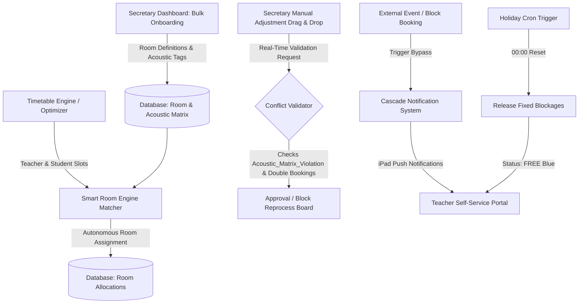

# Technical Specification: Smart Room Engine & Intelligent Timetable Match

This document specifies the architectural design, database schemas, algorithm approaches, and system integrations for the **Smart Room Engine**, the core USP of the Campus platform.

---

## Architecture Overview & Integration

The Smart Room Engine operates as an autonomous scheduling and conflict-resolution micro-engine. It integrates with the central Campus calendar, teacher databases, and room inventory.



---

## STUFE 1: Express-Sammel-Onboarding für Räume

To minimize configuration overhead, the administrative setup uses a high-density bulk-onboarding interface.

### 1.1 Data Schema

Each room contains metadata and binary tags specifying acoustical and structural properties.

```sql
CREATE TYPE room_acoustic_tag AS ENUM (
  'schallisoliert', 
  'podest_vorhanden', 
  'akustisches_klavier', 
  'ensemble_geeignet'
);

CREATE TABLE campus_rooms (
  id UUID PRIMARY KEY DEFAULT gen_random_uuid(),
  school_id UUID NOT NULL REFERENCES campus_schools(id) ON DELETE CASCADE,
  room_number VARCHAR(50) NOT NULL,
  display_name VARCHAR(100),
  max_capacity INT NOT NULL DEFAULT 1,
  acoustic_tags room_acoustic_tag[] NOT NULL DEFAULT '{}',
  created_at TIMESTAMP WITH TIME ZONE DEFAULT CURRENT_TIMESTAMP,
  updated_at TIMESTAMP WITH TIME ZONE DEFAULT CURRENT_TIMESTAMP
);

CREATE UNIQUE INDEX idx_school_room_num ON campus_rooms(school_id, room_number);
```

### 1.2 UI & Bulk Action Layout

The bulk-onboarding interface is rendered as a spreadsheet-like grid where administrators can paste or quickly enter rows and toggle features.

```typescript
interface BulkRoomRow {
  roomNumber: string;
  displayName: string;
  maxCapacity: number;
  isSchallisoliert: boolean;
  hasPodest: boolean;
  hasKlavier: boolean;
  isEnsembleGeeignet: boolean;
}
```

---

## STUFE 2: Der dynamische Stundenplan-Raum-Match

The allocation engine processes room assignments automatically after the timetable scheduling ("Stundenplan-Würfeln") completes or during manual adjustments.

### 2.1 Optimization Algorithm (Constraint Satisfaction Problem)

The matcher models room allocation as a Min-Cost Flow or Constraint Satisfaction Problem (CSP). 

#### Optimization Hierarchy & Hard Constraints
1. **Instrument-to-Room Constraint**: Hard rules mapping instruments to room requirements.
   - Drumset/Percussion $\rightarrow$ Must be `'schallisoliert'` (Acoustic_Matrix_Violation if placed elsewhere).
   - Piano/Keyboards $\rightarrow$ Must contain `'akustisches_klavier'` unless the student brings a digital device.
   - Large Ensemble/Orchestra $\rightarrow$ Must have `'ensemble_geeignet'` and Capacity $\ge$ Ensemble count.
2. **Teacher Availability and Comfort Constraints**:
   - Protect minutewise start, end, and break times specified by teachers.
   - Minimize room changes for a teacher within a single teaching block to avoid instrument transportation delays.

#### Mathematical Objective Function

For each time slot $t$, let $X_{i, r}$ be a binary variable indicating if teacher/class $i$ is assigned to room $r$.

$$\text{Minimize } \sum_{i} \sum_{r} C_{i, r} \cdot X_{i, r} + \gamma \cdot \sum_{i} \text{RoomChanges}(i)$$

Where:
- $C_{i, r}$ represents the mismatch cost between teacher/instrument $i$ and room $r$ properties. If a hard constraint is violated, $C_{i, r} = \infty$.
- $\text{RoomChanges}(i)$ is a penalty term activated when teacher $i$ is moved between different rooms during consecutive slots.
- $\gamma$ is a weighting coefficient prioritizing spatial continuity for teachers.

### 2.2 Real-time Drag & Drop Validation (`Acoustic_Matrix_Violation`)

When a teacher manually relocates a student slot, the system intercepts the database write with a transaction verification function:

```typescript
export async function validateRoomAssignment(
  lessonId: string,
  targetRoomId: string,
  targetTimeSlot: TimeSlot
): Promise<{ valid: boolean; errorType?: 'Acoustic_Matrix_Violation' | 'Double_Booking' | null }> {
  // 1. Check for physical double bookings
  const hasConflict = await checkDoubleBooking(targetRoomId, targetTimeSlot);
  if (hasConflict) {
    return { valid: false, errorType: 'Double_Booking' };
  }

  // 2. Resolve room tags and lesson instrument
  const lessonDetails = await getLessonDetails(lessonId);
  const room = await getRoomDetails(targetRoomId);

  if (lessonDetails.instrument === 'Drums' && !room.acoustic_tags.includes('schallisoliert')) {
    return { valid: false, errorType: 'Acoustic_Matrix_Violation' };
  }

  return { valid: true, errorType: null };
}
```

---

## STUFE 3: Externe Sperrung & Event-Blockierung

The protection shield prevents internal conflicts when rooms are utilized for public concerts, exams, or external rentals.

### 3.1 Event Lock Data Model

```sql
CREATE TABLE room_blocks (
  id UUID PRIMARY KEY DEFAULT gen_random_uuid(),
  room_id UUID NOT NULL REFERENCES campus_rooms(id) ON DELETE CASCADE,
  start_time TIMESTAMP WITH TIME ZONE NOT NULL,
  end_time TIMESTAMP WITH TIME ZONE NOT NULL,
  block_reason VARCHAR(255) NOT NULL,
  is_external BOOLEAN DEFAULT false,
  created_at TIMESTAMP WITH TIME ZONE DEFAULT CURRENT_TIMESTAMP
);
```

### 3.2 The Cascade Bypass Workflow

When a block is created:
1. **Identify Affected Slots**: Retrieve all teaching sessions intersecting $[start\_time, end\_time]$ in the specified room.
2. **Flag in Live Classroom**: The UI updates the status of the affected lessons immediately, changing their visual state to "Conflict/Displaced" (Red outline).
3. **Asynchronous Notification**:
   - Send WebSocket updates directly to the affected teachers' iPads.
   - Recommend the top 3 alternative rooms matching the acoustic requirements of the instrument.

---

## STUFE 4: Automatischer Ferien-Reset & Raum-Self-Service

During official holiday periods, room resources are optimized for flexible use and makeup lessons.

### 4.1 Automated Holiday Reset

A cron executor triggers at midnight on the first day of an official holiday:

```sql
-- Resets all recurring weekly room blockages during designated holiday ranges
UPDATE lesson_slots
SET room_id = NULL
WHERE school_id = :school_id
  AND is_recurring = true
  AND slot_date BETWEEN :holiday_start AND :holiday_end;
```
All affected rooms change their state to **FREE (Blue)**.

### 4.2 iPad Self-Service for Teachers

Teachers can request rooms for voluntary workshops or makeup sessions through a mobile view. The system dynamically filters rooms matching their active instrument qualification.

* Request status: `pending`
* Visual indication: Dotted border in scheduling view.

### 4.3 1-Click Administrative Approval Workflow

Administrators review pending requests in a unified inbox. 

```typescript
async function approveRoomRequest(requestId: string): Promise<void> {
  const request = await db.roomRequests.get(requestId);
  
  await db.transaction(async (tx) => {
    // 1. Confirm room availability
    await tx.confirmRoomFree(request.roomId, request.timeSlot);
    // 2. Update request status
    await tx.roomRequests.update(requestId, { status: 'approved' });
    // 3. Bind room to lesson slot
    await tx.lessonSlots.update(request.slotId, { roomId: request.roomId });
    // 4. Update digital door display
    await tx.doorDisplays.sync(request.roomId);
  });
}
```
Upon confirmation, the tablet display outside the corresponding physical room updates via API, securing the slot.
